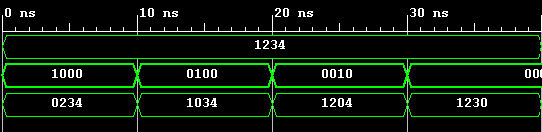
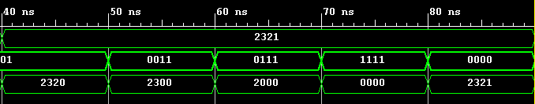
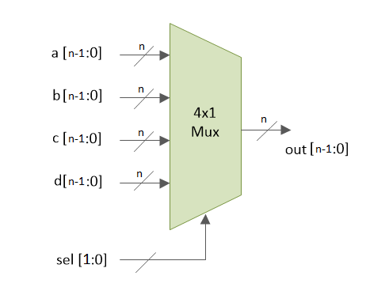
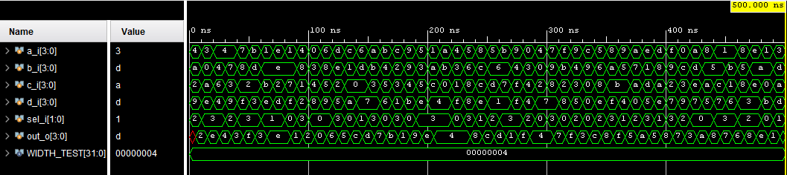
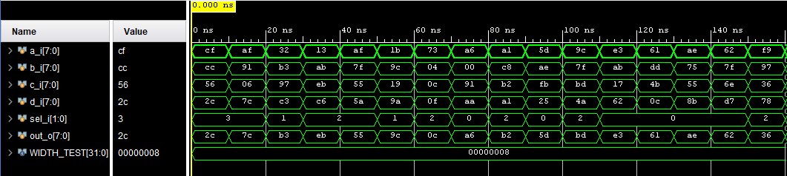
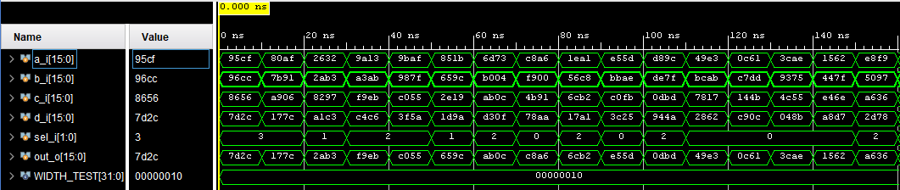

# Laboratorio 1

## 1. Abreviaturas y definiciones
- **FPGA**: Field Programmable Gate Arrays

## 2. Referencias
[0] David Harris y Sarah Harris. *Digital Design and Computer Architecture. RISC-V Edition.* Morgan Kaufmann, 2022. ISBN: 978-0-12-820064-3

## 3. Desarrollo

### 3.2 Módulo "module_SBL"
Este modulo toma cuatro bits de entrada `s_i` y se vuelven `0` todos los bits de entrada al tiempo si el enable `en_i` esta en `1`, la salida de dichos bits se puede apreciar en los leds de la FPGA `led_o`.

#### 1. Encabezado del módulo
```SystemVerilog
module module_SBL(
    input  logic [3:0] s_i,
    input  logic       en_i,
    output logic [3:0] led_o
    );
```

#### 2. Parámetros
El modulo no posee parametros

#### 3. Entradas y salidas:
- `s_i`: bits de entrada mediante switches.
- `en_i`: deshabilitador de grupo de cuatro bits.
- `led_o`: salida del modulo. Depende de `s_i` e `en_i` para poder apreciar su resultado final.

#### 4. Criterios de diseño
El modulo se basa en los siguientes criterios de diseño

[](https://postimg.cc/1fjytsJB)

Donde las expresiones obtenidas se usaron para describir el comportamiento del bloque dentro de vivado.

#### 5. Testbench
No se ha diseñado testbench para este bloque.

### 3.2 Módulo "module_top"
Este modulo se encarga de llamar al module `module_SBL` 4 veces para cuatro entradas de 4 bits que corresponden a los switches `s_pi`, ademas, de recibir 4 habilitadores que corresponden a los botones en la FPGA `en_pi` y finalmente su salida representa la configuracion final de los bits de entrada que tambien depende de los botones de verificacion `leds_po`.

#### 1. Encabezado del módulo
```SystemVerilog
module module_top(
    input  logic [15:0] s_pi,
    input  logic [3:0]  en_pi,
    output logic [15:0] leds_po
    );
```

#### 2. Parámetros
El modulo no posee parametros

#### 3. Entradas y salidas:
- `s_pi`: bits de entrada mediante switches.
- `en_pi`: deshabilitador de grupo de cuatro bits.
- `led_po`: salida del modulo. Depende de `s_pi` e `en_pi` para poder apreciar su resultado final.

#### 4. Criterios de diseño
El modulo se basa en el siguiente diagrama de bloques

[](https://postimg.cc/vDnFGfCP)

El diagrama anterior se observa donde se toma `module_SBL` en 4 bloques y se conectan con `s_pi` de 16 bits y con `en_pi` de 4 bits, las entradas anteriores corresponden a los switches y los botones de la FPGA

#### 5. Testbench
El testbench se presenta en el modulo `tb_module_top` donde primero se establece una entrada para los switches de `16'b0001001000110100` y luego los botones se cambian de uno a uno para verificar que los valores de los switches en ese momento sea de `0`, dentro del constraint se observan los valores en hexadecimal para ver de forma mas clara el funcionamiento, luego, se establece un nuevo valor para los swithches de `16'b0010001100100001` y luego se los botones se iran presionando de manera que al final solo quede `0`.





### 3.3 Módulo "module_mux_4_1"
Este módulo representa un multiplexor de 4 entradas de ancho parametrizable y una entrada de selección que escoge cual de las entradas se mostrará a la salida.

#### 1. Encabezado del módulo
```SystemVerilog
module module_mux_4_1 #(
    parameter BUS_WIDTH = 4
)(
    input  logic [BUS_WIDTH - 1:0]   a_i,    
    input  logic [BUS_WIDTH - 1:0]   b_i,
    input  logic [BUS_WIDTH - 1:0]   c_i,
    input  logic [BUS_WIDTH - 1:0]   d_i,
    input  logic [1:0]               sel_i,
    output logic [BUS_WIDTH - 1:0]  out_o
);
```
#### 2. Parámetros
- `BUS_WIDTH`: Define el ancho de los datos de entrada y salida del multiplexor.

#### 3. Entradas y salidas
- `a_i`  : Entrada del multiplexor
- `b_i`  : Entrada del multiplexor
- `c_i`  : Entrada del multiplexor
- `d_i`  : Entrada del multiplexor
- `sel_i`: Entrada de selección del multiplexor
- `out_o`: Salida del multiplexor

#### 4. Criterios de diseño
El módulo se basa en el funcionamiento de un multiplexor donde la salida a la entrada seleccionada, en la siguiente figura se ilustra el bloque de multiplexor de 4 a 1. 



#### 5. Testbench
El testbench del multiplexor está en `tb_module_mux_4_1.sv`. En este testbench se genera una instancia del multiplexor y se generan entradas de ancho de 4, 8 y 16 bits para probar el funcionamiento, además se implementó un for-loop para generar un conjunto de datos de entrada de 50 datos para cada entrada de manera aleatoria.

Las pruebas que se muestra a continuación son simulación post-síntesis, la primer imagen corresponde a una prueba con ancho de datos de 4 bits. Se observa que los datos de entrada se generan cada 10 ns.



La segunda prueba es con un ancho de 8 bits.



La última es con un ancho de 16 bits.



### 3.4 Módulo "module_sevseg"
Este modulo habilita el funcionamiento de los siete segmentos en la FPGA, al recibir una entrada `d_i` de 4 bits este modulo funciona como codificador que dependiendo del valor de la entrada, activara los catodos correspondientes para poder formar la figura que representa el valor insertado, cabe destacar, que los catodos y los anodos son activos en bajo.

#### 1. Encabezado del módulo
```SystemVerilog
module module_sevseg(
    input logic  [3:0] d_i,
    output logic [6:0] s_o,
    output logic [7:0] en 
    );
```

#### 2. Parámetros
El modulo no posee parametros

#### 3. Entradas y salidas:
- `d_i`: bits de entrada que se interpreta como una valor en hexadecimal.
- `s_o`: salida de los siete segmentos del modulo.
- `en`: habilitador de anodos, para el presente caso, se mantienen como un valor constante.

#### 4. Criterios de diseño
El  bloque que representa el modulo es el siguiente 


Ademas, los criterios de diseño son los siguientes 


En la imagen anterior se represemnta en la tabla de verdad los valores esperados segun la entrada de 4 bits que reciba.

#### 5. Testbench
No se ha diseñado testbench para este bloque 

### 3.4 Módulo "top_segsev"
Este modulo agrega el mux de 4 a 1 que fue diseñado en el laboratorio con el fin de poder multiplexar varias entradas `s_i`y poder ver varios resultados en el 7 segmentos `s_o`.

#### 1. Encabezado del módulo
```SystemVerilog
module top_segsev(
    input logic  [15:0] s_i,
    input logic  [1:0]  b_i,
    output logic [6:0]  s_o,
    output logic [7:0]  en 
    );
```

#### 2. Parámetros
Este modulo no posee parametros

#### 3. Entradas y salidas:
- `s_i`: entradas que van directo al mux.
- `b_i`: seleccion de salida.
- `s_o`: salida de los siete segmentos
- `en` : habilitador de los anodos.

#### 4. Criterios de diseño
El modulo se basa en los siguientes criterios de diseño


#### 5. Testbench
El testbench presenta el modulo `top_segsev` al cual se le establece una entrada de `16'h12AF` donde cada termino se va seleccionando mediante el multiplexor, por ejemplo, en el primer cambio donde la entrada es de `2'b10` se puede apreciar una respuesta de `7'b0000010`, dicho valor corresponde a A en hexadecimal.


### 3.5 Módulo "1_bit_full_adder"

Este modulo corresponde a un sumador de un bit con descripción estructural.

#### 1. Encabezado del módulo
```SystemVerilog
module one_bit_full_adder_sv 
        (

        input logic a_i, b_i, ci_i,                            //Entradas
        output logic sum_o, co_o                               //Salidas
        
        );
```

#### 2. Parámetros

Este modulo no posee parametros

#### 3. Entradas y salidas:
- `a_i`: entrada de un sumando de un bit.
- `b_i`: entrada de un sumando de un bit.
- `c_i`: entrada de un acarreo.
- `sum_o` : Resultado de la suma.
- `Co_o`: Acarreo de salida

#### 4. Criterios de diseño
El modulo se basa en los siguientes criterios de diseño donde se muestra las ecuaciones características al realizar los mapas de karnaugh.


#### 5. Testbench

El testbench de este modulo correspondió debido a su sencillez a probar las 8 distintas combinaciónes en una simulación de comportamiento. 


### 3.5 Módulo "ripple_carry_adder"

Este modulo corresponde a un sumador de un bit con descripción estructural.

#### 1. Encabezado del módulo
```SystemVerilog
module ripple_carry_adder 
    #(
    
    parameter ANCHO = 8             //Parametro del ancho
    
    )
    (
    
    //Definición de entradas
    
    input logic [ANCHO - 1 : 0] a_i, 
    input logic [ANCHO - 1 :0 ] b_i,
    input logic                 ci_i,
    
    //Definición de salidas
    
    output logic [ANCHO - 1 :0] sum_o,
    output logic [ANCHO - 1 :0] co_o 
    
    );
```

#### 2. Parámetros

Este modulo posee el parámetro ANCHO el cual corresponde al ANCHO de palabra de los sumandos

#### 3. Entradas y salidas:
- `a_i`: entrada de un sumando de ancho ANCHO.
- `b_i`: entrada de un sumando  de ancho ANCHO.
- `c_i`: entrada de un acarreo.
- `sum_o` : Resultado de la suma de ancho ANCHO.
- `Co_o`: Acarreo de salida de ancho ANCHO + 1.

#### 4. Criterios de diseño
El modulo se basa en los siguientes criterios de diseño donde se concatenan sumadores de 1 bit. 


#### 5. Testbench

Para el testbench de este modulo se hizo una simulación de comportamiento para ver el funcionamiento de los resultados donde se sumaron 100 millones de muestras de 64 bits. Posteriormente, se realizará una simulación post sintesis para comparar los tiempos de este sumador contra el sumador de un carry lookahead adder. Se observará en un modulo más adelante llamado rca_vs_cla.   


### 3.5 Módulo "1_bit_full_adder_CLA"

Este modulo corresponde a un sumador de un bit cutilizado para el carry look ahead

#### 1. Encabezado del módulo
```SystemVerilog
module one_bit_full_adder_cla 
    (
    
    // Se definen las entradas
    
    input logic a_i,
    input logic b_i,
    input logic ci_i,
    
    // Se definen las salidas
    
    output logic sum_o,
    output logic p_o,
    output logic g_o
    );
    
```

#### 2. Parámetros

Este modulo no posee parametros

#### 3. Entradas y salidas:
- `a_i`: entrada de un sumando de un bit.
- `b_i`: entrada de un sumando de un bit.
- `c_i`: entrada de un acarreo.
- `sum_o` : Resultado de la suma.
- `p_o`: Acarreo propagado.
- `g_o`: Acarreo generado 


#### 4. Criterios de diseño
El modulo se basa en los siguientes criterios de diseño donde se muestra las ecuaciones características al realizar los mapas de karnaugh.


#### 5. Testbench

El testbench de este modulo correspondió debido a su sencillez a probar las 8 distintas combinaciónes en una simulación de comportamiento y observar los resultados obtenidos. 


### 3.5 Módulo "carry_lookahead"

Este modulo corresponde al calculador de acarreos para el carry_lookahead_adder.

#### 1. Encabezado del módulo
```SystemVerilog
module carry_lookahead (

// Se definen la entrada del carry inicial

    input logic ci_i,
    
//  Se definen las entradas del carry propagado

    input logic p0_i,
    input logic p1_i,
    input logic p2_i,
    input logic p3_i,

// Se definen las entradas del carry generado
    
    input logic g0_i,
    input logic g1_i,
    input logic g2_i,
    input logic g3_i,
    
// Se definen los carrys de salida
    
    output logic co1_o,
    output logic co2_o,
    output logic co3_o,
    output logic co4_o
);
    
```

#### 2. Parámetros

Este modulo no posee parametros

#### 3. Entradas y salidas:
- `c_i`: Acareo inicial.
- `p0_i`: Entrada acarreo propagado por el primer sumador de un bit cla.
- `p1_i`: Entrada acarreo propagado por el segundo sumador de un bit cla.
- `p2_i`: Entrada acarreo propagado por el tercer sumador de un bit cla.
- `p3_i`: Entrada acarreo propagado por el tercer sumador de un bit cla.
- `g0_i`: Entrada acarreo generado por el primer sumador de un bit cla.
- `g1_i`: Entrada acarreo generado por el segundo sumador de un bit cla. 
- `g2_i`: Entrada acarreo generado por el tercer sumador de un bit cla.
- `g3_i`: Entrada acarreo generado por el tercer sumador de un bit cla.
- `c1_o`: Salida del acarreo para el segundo sumador.
- `c2_o`: Salida del acarreo para el tercer sumador.
- `c3_o`: Salida del acarreo para el cuarto sumador.
- `c4_o`: Salida del acarreo para el quinto siguiente sumador y predictor de acarreos.


#### 4. Criterios de diseño
El modulo se basa en los siguientes criterios de diseño donde se muestra las ecuaciones características para el carry_lookahead.


#### 5. Testbench

A este modulo no se realizó testbench debido a que sería utilizado en el sumador el cual si será testeado.

### 3.5 Módulo "carry_lookahead_adder"

Este modulo corresponde al sumador completo carry lookahead adder.

#### 1. Encabezado del módulo
```SystemVerilog
module carry_lookahead_adder (

    input logic [7:0] a_i,
    input logic [7:0] b_i,
    input logic       ci_i, 
    
    output logic [7:0] sum_o,
    output logic [7:0] co_o

);
    
```

#### 2. Parámetros

Este modulo no posee parametros

#### 3. Entradas y salidas:
- `a_i`: entrada de un sumando dede  ancho 8.
- `b_i`: entrada de un sumando dede  ancho 8.
- `c_i`: entrada de un acarreo.
- `sum_o` : Resultado de la suma de ancho 8
- `Co_o`: Acarreos de salida de ancho 9.

#### 4. Criterios de diseño
El modulo se basa en los siguientes criterios de diseño donde se muestra las ecuaciones características para el carry_lookahead.


#### 5. Testbench

A este modulo se realizó un testbench donde se sumaron ciertos numeros de 8 bits y se observaron los resultados. Esto mediante un simulación de comportamiento, posteriormente se realizó una simulación postsitensis donde se comparo este sumador con un RCA.


### 3.5 Módulo "top_sumadores"

Este modulo corresponde a un modulo top donde se ejecutan los 2 sumadores para realizarar la comparación de tiempos.

#### 1. Encabezado del módulo

```SystemVerilog
module top_sumadores(
    input logic [7:0] a_i,
    input logic [7:0] b_i,
    input logic       ci_i, 
    
    output logic [7:0] rca_sum_o,
    output logic [8:0] rca_co_o,
    
    output logic [7:0] cla_sum_o,
    output logic [8:0] cla_co_o
    
    );
    
```

#### 2. Parámetros

Este modulo no posee parametros

#### 3. Entradas y salidas:
- `a_i`: entrada de un sumando dede  ancho 8.
- `b_i`: entrada de un sumando dede  ancho 8.
- `c_i`: entrada de un acarreo.
- `rca_sum_o` : Resultado de la suma de ancho 8 del rca
- `rca_co_o`: Acarreos de salida de ancho 9 del rca.
- `cla_asum_o` : Resultado de la suma de ancho 8 del cla.
- `cla_co_o`: Acarreos de salida de ancho 9 del cla.

#### 4. Criterios de diseño

El modulo se basa en llamar los 2 sumadores. 

#### 5. Testbench

A este modulo se realizó un testbench donde se sumaron 2 numeros y un acarreo el cual genera la mayor cantidad de acarreos posibles. Esto con la inteción de comparar los tiempos de ambos sumadores. Los resultados se puede ver en la imagen y los tiempos correspodieron a los mostrados abajo, esto nos deja observar que para un mismo numero de 8 bits el CLA se estabiliza un ns más pronto que el RCA, esta diferencia puede ir aumentado al aumentar el ancho de los sumandos. Por otra parte, al comparar el área de los sumadores obtuvimos que el CLA posee más área que el RCA.

##### 5.1 Tiempo de contaminación

- `rca_sum_o` : 5.2 ns
- `rca_co_o`: 4.4 ns
- `cla_sum_o` : 5.2 ns
- `cla_co_o`: 5.2 ns

##### 5.2 Tiempo de propagación

- `rca_sum_o` : 1.84 ns
- `rca_co_o`: 2.6 ns
- `cla_sum_o` : 1.83 ns
- `cla_co_o`: 1.82 ns


### 3.6 Módulo "module_ALU"
Este módulo corresponde a una ALU con 10 operaciones parametrizable.

#### 1. Encabezado del módulo
```SystemVerilog
module module_ALU
     #( parameter N=4
     )
     ( input  logic  [N-1:0] alu_a,
       input  logic  [N-1:0] alu_b,
       input  logic          alu_flag_in,
       input  logic  [3:0]   alu_control,
       output logic  [N-1:0] alu_result,
       output logic          alu_flags,
       output logic          cero
      );
```
#### 2. Parámetros
- `N`: Define el ancho de los datos de entrada y salida de la ALU.

#### 3. Entradas y salidas
- `alu_a`  : Entrada a la ALU
- `alu_b`  : Entrada a la ALU
- `alu_flag_in`  : Entrada de selección dentro de una misma operación 
- `alu_control`  : Entrada de selección de operación
- `alu_result`: Salida de la ALU
- `alu_flags`: Salida para las operaciones de corrimiento que indica el último bit en salir 
- `cero`: Salida que cambia a 1 si el resultado de la operación es cero

#### 4. Criterios de diseño
El módulo se basa en una ALU la cual posee operaciones aritméticas y lógicas con un total de 10, en la siguiente figura se puede observar el diagrama de bloques de esta ALU. 


#### 5. Testbench
Para este módulo se creó un testbench para datos de 4 bits donde se recorre toda la con números de entrada dados, además este es de autochequeo por lo que las operaciones se realizan también en el testbench y por medio de un if se comparan los resultados del módulo con los obtenidos en el testbench para así de esta forma comprobar que los resultados están correctos.

La prueba definiendo alu_flag_in en 0 se encuentra en la siguiente imágen. 


Y la prueba con alu_flag_in en 1 se puede observar en la siguiente imágen. 


## Apendices:

[](https://postimg.cc/4nQXtj1C)
### Apendice 1:
texto, imágen, etc
