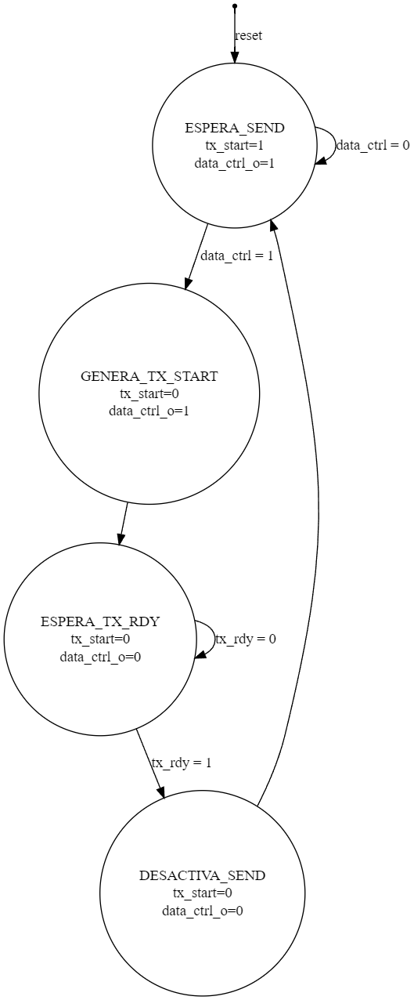
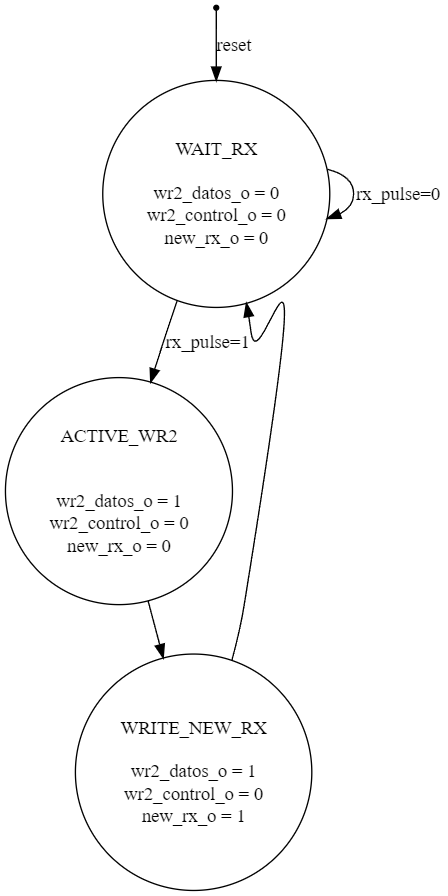
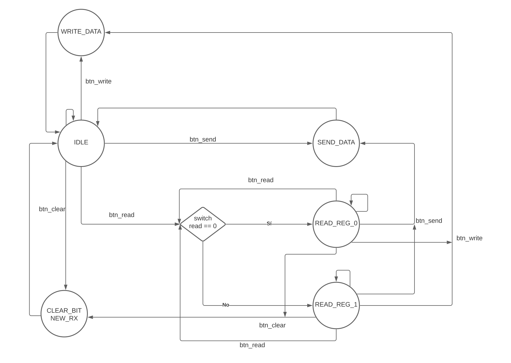
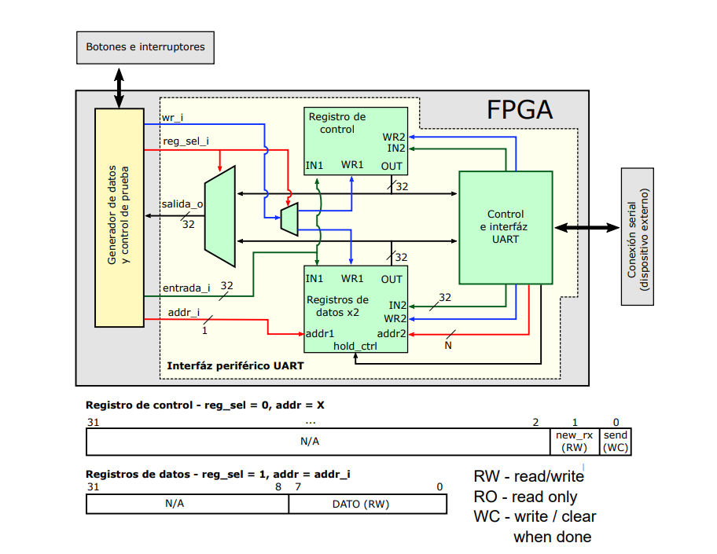
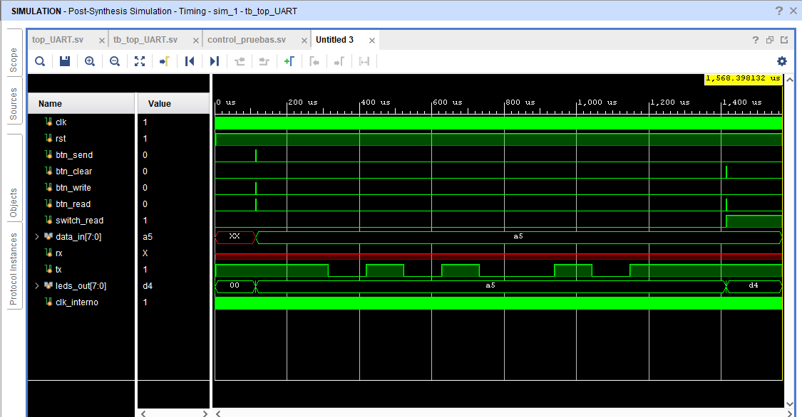

# Laboratorio 3
Autores: Irán Medina Jeremy Cordoba Ivannia Fernandez Jesús Rojas
## 1. Abreviaturas y definiciones
- **FPGA**: Field Programmable Gate Arrays

## 2. Referencias
[0] David Harris y Sarah Harris. *Digital Design and Computer Architecture. RISC-V Edition.* Morgan Kaufmann, 2022. ISBN: 978-0-12-820064-3

## 3. Desarrollo

### 1.1 Módulo "FSM_SPI"

Este módulo corresponde a la máquina de estados del SPI que se encarga de la comunicacion con cualquier periferico que soporte dicho tipo de comunicacion.

#### 1. Encabezado del módulo
```SystemVerilog
module FSM_SPI #( BITS_ADDRS = 5) 
    (
    input  logic                    clk_i,
    input  logic                    rst_i,
    input  logic [31:0]             inst_i,
    input  logic                    reg_dat_i,
    
    output logic                    ss_o,
    output logic                    mosi_o,
    output logic                    sclk_o,
    output logic                    wr1_o,
    output logic [31:0]             in1_o,
    output logic                    wr2_o,
    output logic [BITS_ADDRS - 1:0] addr2_o,
    output logic                    hold_ctrl_o,
    output logic                    en_dat_i,
    output logic                    psclk_o,
    output logic                    nsclk_o
    );
```
#### 2. Parámetros
No hay parámetros en este módulo.

#### 3. Entradas y salidas:
- `clk_i`: Entrada de reloj
- `rst_i`: Entrada de reset 
- `inst_i`: Instruccion de entrada.
- `reg_dat_i`: Dato bit a bit proveniente del registro que almacena el dato a enviar.
- `ss_o`: chip select del slave
- `mosi_o`: master output slave input
- `sclk_o`: reloj para el slave
- `wr1_o`: habilitador de escritura para el registro de control
- `in1_o`: dato a reescribir en el registro de control
- `wr2_o`: habilitador de escritura en el banco de registros
- `addr2_o`: direccion para el banco de registros 
- `hold_ctrlo`: bit que prioriza la escritura en los bancos por parte de la maquina de estados
- `en_dat_i`: escribe el dato que se va a enviar en el registro de envio
- `psclk_o`: pulso al posedge de sclk
- `nsclk_o`: pulso al negedge de sclk

#### 4. Criterios de diseño

En la siguiente figura se puede observar el diagrama de estados:


En la siguiente figura se puede observar el diagrama de estados:


#### 5. Testbench
No hay simulacion para este modulo.

### 1.2 Módulo "reg_control"

Este modulo se encarga del almacenamiento de la instruccion para el funcionamiento de la SPI.

#### 1. Encabezado del módulo
```SystemVerilog
module reg_control(
    input  logic        clk_i,
    input  logic        rst_i,
    input  logic        wr1_i,
    input  logic        wr2_i,
    input  logic        hold_ctrl_i,
    
    input  logic [31:0] data1_i,
    input  logic [31:0] data2_i,
    
    output logic [31:0] out_o

);
```
#### 2. Parámetros
No hay parámetros en este módulo.

#### 3. Entradas y salidas:
- `clk_i`: Entrada de reloj
- `rst_i`: Entrada de reset 
- `wr1_i`: Habilita la escritura que no es del controlador
- `wr2_i`: Habilita la escritura del controlador 
- `hold_ctrl_i`: Prioriza la escritura del FSM SPI
- `data1_i`: dato de entrada que no es del controlador
- `data2_i`: dato de entrada del controlador
- `out_o`: intruccion guardada


#### 4. Criterios de diseño
El diseño consta de un unico registro que posee mas de una entrada habilitadora de escritura , con el `hold_ctrl_i` priorizando la escritura por parte del SPI.


#### 5. Testbench
Este módulo no tiene testbench ya que se prueba en el módulo `top_interfaz_spi`.

### 1.3 Módulo "banco_registros_spi"

Este modulo se encarga del almacenamiento de los datos que se enviaran y los recibidos por medio de la comunicacion SPI.

#### 1. Encabezado del módulo
```SystemVerilog
module banco_registros_spi#(
        parameter N = 32,
        parameter W = 32
     )
     (  //Entradas
        input  logic [$clog2(N)-1:0] addr1_i,
        input  logic [$clog2(N)-1:0] addr2_i,
        input  logic                 clk_i,
        input  logic                 rst_i,
        input  logic                 hold_ctrl_i,
        input  logic                 wr1_i,
        input  logic                 wr2_i,
        input  logic [W-1:0]         data1_i,
        input  logic [W-1:0]         data2_i,
        
        //Salidas
        output logic [W-1:0]         data_o
       );
```

#### 2. Parámetros
- `N`: es la cantidad de direcciones a las que se puede acceder.
- `W`: es el tamaño de los datos guardados.

#### 3. Entradas y salidas:
- `clk_i`: Entrada de reloj
- `rst_i`: Entrada de reset 
- `addr1_i`: Direccion que no pertenece al SPI.
- `addr2_i`: Direccion que indica el SPI.
- `hold_ctrl_i`: Prioriza la escritura del FSM SPI.
- `wr1_i`: Habilitador de escritura desde fuera del SPI
- `wr2_i`: Habilitador de escritura del SPI
- `data1_i`: dato de entrada que no es del controlador
- `data2_i`: dato de entrada del SPI.
- `data_o`: intruccion guardada.


#### 4. Criterios de diseño
Se tomo el banco de registros ya creado anteriormente y se le agrego la funcion de guardar desde dos fuentes diferentes ademas de la priorizacion de una de las fuentes.

#### 5. Testbench
Este módulo no tiene testbench ya que se prueba en el módulo `top_interfaz_spi`.

### 1.4 Módulo "demux_2_a_1"

Este modulo se encarga de seleccionar si escribir en `reg_control` o `banco_registros_spi`, funciona para lograr escribir un dato desde fuera de `top_interfaz_spi`.

#### 1. Encabezado del módulo
```SystemVerilog
module demux_2_a_1 (

    input logic   in_i,
    input logic   sel_i,

    output logic  out1_o,
    output logic  out2_o
);
```

#### 2. Parámetros
Este modulo no posee parametros.

#### 3. Entradas y salidas:
- `in_i`: entrada a demultiplexar
- `sel_i`: selecciona en que posicion poner la entrada en la salida
- `out1_o`: posicion 1 de salida
- `out2_o`: posicion 2 de salida


#### 4. Criterios de diseño
Se tiene una entrada que va a una determinada posicion de salida segun la seleccion de entrada, si la entrada se encuentra en una de las posiciones de salida, la posicion que no se este usando tiene un valor de 0.

#### 5. Testbench
Este módulo no tiene testbench ya que se prueba en el módulo `top_interfaz_spi`.

### 1.5 Módulo "mux_2_a_1"

Este modulo se encarga de multiplexar mas de una entrada a una sola salida segun la entrada de seleccion.

#### 1. Encabezado del módulo
```SystemVerilog
module mux_2_a_1 (

    input logic [31:0] a_i,
    input logic [31:0] b_i,
    input logic        sel_i,

    output logic [31:0] out_o
);
```

#### 2. Parámetros
Este modulo no posee parametros.

#### 3. Entradas y salidas:
- `a_i`: entrada 1 a multiplexar
- `b_i`: entrada 2 a multiplexar
- `sel_i`: selecciona cual de las entradas poner a las salidas.
- `out_o`: entrada puesta en la salida.

#### 4. Criterios de diseño
Un simple multiplexo que pone una determinada entrada a la salida segun la seleccion que se tenga.

#### 5. Testbench
Este módulo no tiene testbench ya que se prueba en el módulo `top_interfaz_spi`.

### 1.6 Módulo "top_fsm_spi"

Este modulo contiene los registros de envio y recepcion, ademas de la maquina de estados del SPI por lo que es practicamente un SPI completo.


#### 1. Encabezado del módulo
```SystemVerilog
module top_fsm_spi(

    input  logic          clck_i,
    input  logic          rst_i,
    input  logic [31 : 0] inst_i,
    input  logic [31 : 0] reg_i,
    input  logic          miso_i,
    
    output logic          ss_o,
    output logic          mosi_o,
    output logic          sclk_o,
    output logic          wr1_o,
    output logic [31 : 0] in1_o,
    output logic          wr2_o,
    output logic [4 : 0]  addr2_o,
    output logic          hold_ctrl_o,
    output logic [31 : 0] in2_o


);
```

#### 2. Parámetros
Este modulo no posee parametros.

#### 3. Entradas y salidas:
- `clck_i`: reloj del modulo
- `rst_i`: reset del modulo
- `inst_i`: intruccion de entrada del modulo
- `reg_i`: entrada del banco de registros
- `miso_i`: entrada del dato recibido por el slave
- `ss_o`: chip select
- `mosi_o`: salida del SPI del dato enviado
- `sclk_o`: reloj del SPI
- `wr1_o`: habilitador de escritura al registro de control
- `in1_o`: instruccion al registro de control
- `wr2_o`: habilitador de escritura al banco de registros
- `addr2_o`: direccion para el banco de registros 
- `hold_ctrl_o`: indica prioridad
- `in2_o`: dato a escribir en el banco de registros.


#### 4. Criterios de diseño
En la siguiente figura se puede observar el diagrama de bloques en la que se baso el diseño del modulo:


#### 5. Testbench
A continuacion se presentan los resultados de la simulacion del SPI, se puede apreciar que la cantidad de ciclos y bits son 8 es decir que si funciona.


### 1.7 Módulo "top_interfaz_spi"

Este modulo contiene los registros de datos y control, ademas del modulo `top_fsm_spi` por lo que con este modulo ya es posible controlar el SPI mediante instrucciones y controlar sus datos.


#### 1. Encabezado del módulo
```SystemVerilog
module top_interfaz_spi(
    // Variables de entrada del tiempo 

    input logic clck_i,
    input logic rst_i,

    //Variables al modulo spi 

    input logic          wr_i ,
    input logic          reg_sel_i,
    input logic [ 4 : 0] addr_in_i,
    input logic [31 : 0] entrada_i,
    input logic          miso_i,

    //Variables de salida del modulo spi

    output logic [31 : 0] salida_o,
    output logic          mosi_o,
    output logic          sclk_o,
    output logic          cs_o
    );

```

#### 2. Parámetros
Este modulo no posee parametros.

#### 3. Entradas y salidas:
- `clck_i`: reloj del modulo
- `rst_i`: reset del modulo
- `wr_i`: habilitador de escritura
- `reg_sel_i`: seleccion de donde escribir
- `addr_in_i`: direccion para el banco de registros
- `entrada_i`: entrada de instruccion o dato
- `miso_i`: entrada del periferico al SPI
- `salida_o`: salida de los resultados de instruccion y datos
- `mosi_o`: dato de envio del SPI
- `sclk_o`: reloj generado por el SPI
- `cs_o`: chip select


#### 4. Criterios de diseño
En la siguiente figura se puede observar el diagrama de bloques en la que se baso el diseño del modulo:


#### 5. Testbench
A continuacion se presentan los resultados de la simulacion del `top_interfaz_spi, se puede apreciar comos se realizan dos transacciones ambas con su cantidad de ciclos que corresponde y el dato de 1 se envia y se recibe.


### 1.8 Módulo "module_top_prueba_spi"

Este modulo es el `top_interfaz_spi` con un bloque de pruebas que permite probar el SPI en la FPGA, el bloque de pruebas contiene diferentes configuraciones con el fin de probar por completo el modulo.

#### 1. Encabezado del módulo
```SystemVerilog
module module_top_prueba_spi(
    input logic             miso_i,
    input logic             wr_i,
    input logic             clck_i,
    input logic             reg_sel_i,
    input logic   [ 2 : 0]  seleccion_generador,
    input logic   [ 4 : 0]  addr_in_i,
    
    output logic [ 3 : 0]   en_o,
    output logic [ 6 : 0]   seg_o,
    output logic            sclk_o,
    output logic            cs_o
    
    );
    
    
```

#### 2. Parámetros
Este modulo no posee parametros.

#### 3. Entradas y salidas:


- `miso_i`: entrada master-input slave-output
- `wr_i`: habilitador de escritura para el registro de control o el banco de registros.
- `clck_i`: reloj del modulo.
- `reg_sel_i`: selecciona el registro de control o el banco de registros.
- `seleccion_generador`: selecciona las opciones del generador de datos.
- `addr_in_i`: direccion para el banco de registros.
- `en_o`: habilitador para los anodos del display
- `seg_o`: segmentos del display
- `sclk_o`: reloj generado por el SPI
- `cs_o`: chip select

#### 4. Criterios de diseño
En la siguiente figura se puede observar el diagrama de bloques en la que se baso el diseño del modulo:


#### 5. Testbench
Este modulo no posee testbench.


#### 6. Tabla de constraints

Se realizó la siguiente asignación de pines y elementos de la FPGA.


| Señal         | Pin   | En tarjeta   |
| ------------- |:-----:| ------------:|
| clck_i         |  W5   |      CLK     |
| reg_sel_i   |  V17  |      SW0    |
| seleccion_generador[0]  |  V16  |      SW1    |
| seleccion_generador[1]  |  W16  |      SW2    |
| seleccion_generador[2]   |  W17  |      SW3    |
| addr_in_i[0] |  W15  |      SW4     |
| addr_in_i[1] |  V15   |      SW5     |
| addr_in_i[2] |  W14   |      SW6     |
| addr_in_i[3] |  W13   |      SW7    |
| addr_in_i[4] |  V2   |      SW8   |
| seg_o[5] |  W7   |      CA    |
| seg_o[6] |  W6   |      CB    |
| seg_o[0] |  U8   |      CC    |
| seg_o[1] |  V8   |      CD    |
| seg_o[2] |  U5  |      CE    |
| seg_o[4] |  V5  |      CF   |
| seg_o[3] |  U7  |      CG     |
| en_o[0]    |  U2  |      AN0     |
| en_o[1]    |  U4  |      AN1     |
| en_o[2]    |  V4  |      AN2     |
| en_o[3]    |  W4  |      AN3     |
| wr_i    |  T18  |      BTNU     |
| cs_o    |  J1  |      JA1     |
| miso_i    |  J2  |      JA3     |
| sclk_o    |  G2  |      JA4     |

### 3.1 Módulo "fsm_send"

Este módulo corresponde a la máquina de estados que se encarga del envío de datos de la FPGA a la computadora.

#### 1. Encabezado del módulo
```SystemVerilog
module fsm_send (
    input logic   clk_i,
    input logic   rst_i,
    input logic   data_ctrl_i,  
    input logic   tx_rdy,

    output logic  data_ctrl_o, 
    output logic  tx_start
);
```
#### 2. Parámetros
No hay parámetros en este módulo.

#### 3. Entradas y salidas:
- `clk_i`: Entrada de reloj
- `rst_i`: Entrada de reset 
- `data_ctrl_i`: Bit de "send", para iniciar la transacción
- `tx_rdy_i`: Pulso que indica que se terminó de enviar el dato
- `data_ctrl_o`: Salida hacia el registro de control, que limpia el bit de "send"
- `tx_start_o`: Salida que le indica al UART que inicie la transmisión de datos

#### 4. Criterios de diseño
En la siguiente figura se puede observar el diagrama de estados:




#### 5. Testbench
Este módulo no tiene testbench ya que se prueba en el módulo "top UART"

### 3.2 Módulo "fsm_reception"

Este módulo corresponde a la máquina de estados que se encarga de recibir los datos que envía el computador hacia la FPGA.

#### 1. Encabezado del módulo

```SystemVerilog
module fsm_reception (

    input logic   clk_i,
    input logic   rst_i,
    input logic   rx_pulse_i,         
  
    output logic  wr2_datos_o,       
    output logic  wr2_ctrl_o,        
    output logic  new_rx_o           
 
);
```
#### 2. Parámetros
No hay parámetros en este módulo.

#### 3. Entradas y salidas:
- `clk_i`: Entrada de reloj
- `rst_i`: Entrada de reset 
- `rx_pulse_i`: Pulso que indica que se recibió un dato 
- `wr2_datos_o`: Write enable para el registro de datos
- `wr2_ctrl_o`: Write enable para el registro de control
- `new_rx_o`:  Bit que le indica al registro de control que se recibió un nuevo dato

#### 4. Criterios de diseño
En la siguiente figura se puede observar el diagrama de estados:





#### 5. Testbench
Para este módulo no se realizó testbench ya que se prueba en el módulo "top UART" 

### 3.3 Módulo "reg_control"

Este módulo corresponde a un registro que controla el envío y la recepción de datos.

#### 1. Encabezado del módulo
```SystemVerilog
module reg_control (

    input logic        clk_i,
    input logic        rst_i,
    input logic        wr1_i,
    input logic        wr2_i,
    input logic [31:0] data1_i,
    input logic [31:0] data2_i,

    output logic [31:0] out_o

);
```
#### 2. Parámetros
No hay parámetros en este módulo.

#### 3. Entradas y salidas:
- `clk_i`: Entrada de reloj
- `rst_i`: Entrada de reset 
- `wr1_i`: Entrada que habilita la escritura del dato 1
- `wr2_i`: Entrada que habilita la escritura del dato 2
- `data1_i`: Dato 1 ingresado por el control
- `data2_i`: Dato 2 ingresado por el control
- `out_o`: Salida de lectura del registro


#### 4. Criterios de diseño
El criterio de diseño se basó en las especificiones del instructivo, donde se indica que este registro tendrá dos punteros en los que recibirá un dato de 32 bits, de los cuales solo escribirá o limpiará los dos últimos bits, según lo que le indique la máquina de control de envío y recepción de datos.

#### 5. Testbench
Este módulo no tiene testbench. 


### 3.4 Módulo "reg_datos"

Este módulo corresponde a un banco de registros con dos entradas y dos salidas.

#### 1. Encabezado del módulo
```SystemVerilog
module reg_datos #(
    parameter N = 2,
    parameter W = 32
) (
    input logic          clk_i,
    input logic          rst_i,
    input logic          wr1_i, 
    input logic          wr2_i, 
    input logic [W-1:0]  data1_i, 
    input logic [W-1:0]  data2_i, 
    
    output logic [W-1:0] out1_o, 
    output logic [W-1:0] out2_o  
);
```
#### 2. Parámetros
- `N`: Corresponde a la cantidad de registros que se almacenarán en el banco de registros.
- `W`: Corresponde al ancho de los datos que serán almacenados en el banco de registros.

#### 3. Entradas y salidas:
- `clk_i`: Entrada de reloj
- `rst_i`: Entrada de reset 
- `wr1_i`: Entrada que habilita la escritura en registro 1
- `wr2_i`: Entrada que habilita la escritura en registro 2
- `data1_i`: Dato a enviar al computador
- `data2_i`: Dato recibido desde el computador
- `out1_o`: Salida de lectura del registro 1
- `out2_o`: Salida de lectura del registro 2

#### 4. Criterios de diseño
El criterio de diseño se basó en la creación de un banco de registros como el creado para el laboratorio anterior pero en este caso con dos datos de entrada y dos datos de salida.

#### 5. Testbench
Este módulo no tiene testbench.

#### 6. Tabla de constraints

Se realizó la siguiente asignación de pines y elementos de la FPGA.


| Señal         | Pin   | En tarjeta   |
| ------------- |:-----:| ------------:|
| clk_i         |  W5   |      CLK     |
| btn_send_pi   |  T18  |      BTNU    |
| btn_clear_pi  |  T17  |      BTNR    |
| btn_write_pi  |  W19  |      BNTL    |
| btn_read_pi   |  U17  |      BTND    |
| switch_read_pi|  V17  |      SW0     |
| data_in_pi[0] |  V2   |      SW8     |
| data_in_pi[1] |  T3   |      SW9     |
| data_in_pi[2] |  T2   |      SW10    |
| data_in_pi[3] |  R3   |      SW11    |
| data_in_pi[4] |  W2   |      SW12    |
| data_in_pi[5] |  U1   |      SW13    |
| data_in_pi[6] |  T1   |      SW14    |
| data_in_pi[7] |  R2   |      SW15    |
| rx            |  B18  |      LD17    |
| tx            |  A18  |      LD18    |
| leds_po[0]    |  U16  |      LD0     |
| leds_po[1]    |  E19  |      LD1     |
| leds_po[2]    |  U19  |      LD2     |
| leds_po[3]    |  V19  |      LD3     |
| leds_po[4]    |  W18  |      LD4     |
| leds_po[5]    |  U15  |      LD5     |
| leds_po[6]    |  U14  |      LD6     |
| leds_po[7]    |  V14  |      LD7     |


### 3.5 Módulo "control_pruebas"

Este módulo corresponde al módulo generador de pruebas y control de datos para la interfaz UART.

#### 1. Encabezado del módulo
```SystemVerilog
module control_pruebas (
    input logic         clk_i,
    input logic         rst_i,
    input logic         btn_send_i,     
    input logic         btn_clear_i,    
    input logic         btn_write_i,    
    input logic         btn_read_i,     
    input logic         switch_read_i,  
    input logic [31:0]  data_in_i,
    input logic [31:0]  mux_i,

    output logic        wr_o,
    output logic        reg_sel_o,
    output logic [31:0] data_out_o,
    output logic        addr_o,
    output logic [7:0]  leds_o

);
```
#### 2. Parámetros
No hay parámetros en este módulo.

#### 3. Entradas y salidas:
- `clk_i`: Entrada de reloj
- `rst_i`: Entrada de reset
- `btn_send_i`: Botón para enviar dato
- `btn_clear_i`: Botón para borrar el bit new_rx
- `btn_write_i`: Botón para escribir el dato al banco de registros
- `btn_read_i,`: Botón para leer el banco de registros
- `switch_read_i`: Switch para elegir el registro a leer
- `data_in_i`: Dato a enviar hacia el computador
- `mux_i`: Entrada del mux que muestra el dato del registro seleccionado
- `wr_o`: Salida del write enable hacia los registros
- `reg_sel_o`: Selección del registro control o registro de datos
- `data_out_o`: Dato a enviar hacia el registro de control
- `addr_o`: Selección de uno de los 2 registros del banco de registros
- `leds_o`: Leds que muestran el dato enviado / recibido 

#### 4. Criterios de diseño
El criterio de diseño de este módulo se basa en el diagrama de estados observado en la siguiente figura:



#### 5. Testbench
Para este módulo no se realizó testbench ya que se prueba en el módulo "top UART"


### 3.6 Módulo "top_UART"

Este módulo corresponde al módulo top del UART donde se unen todos los módulos necesarios para que funcione el mismo.

#### 1. Encabezado del módulo
```SystemVerilog
module top_UART (
    input logic         clk_pi,
    input logic         btn_send_pi,      
    input logic         btn_clear_pi,     
    input logic         btn_write_pi,     
    input logic         btn_read_pi,      
    input logic         switch_read_pi,   
    input logic [7:0]   data_in_pi,
    input logic         rx,         

    output logic [7:0]  leds_po,
    output logic        tx
    
);
```
#### 2. Parámetros
No hay parámetros en este módulo.

#### 3. Entradas y salidas:
- `clk_i`: Entrada de reloj
- `btn_send_pi`: Botón que indica que se está enviando un dato a la computadora
- `btn_clear_pi`: Botón para borrar el bit de new_rx
- `btn_write_pi`: Botón que indica que se debe escribir el dato dado por la FPGA en el banco de registros
- `btn_read_pi,`: Botón que indica que se quiere leer un dato del banco de registros
- `switch_read_pi`: Switch utilizado para decidir cual de los dos registros se quiere leer
- `data_in_pi`: Dato a enviar desde la FPGA hacia la computadora
- `rx`: Entrada serial 
- `leds_po`: LEDS para ver el dato enviado/recibido
- `tx`: Salida serial

#### 4. Criterios de diseño
El criterio de diseño de este módulo se basa en el diagrama de bloques de alto nivel mostrado en la siguiente figura:



#### 5. Testbench
El testbench se encuentra en `tb_top_UART.sv` .En la siguiente figura se observa el testbench en simulación post-síntesis del módulo top UART. En la prueba se observa en primer lugar el dato que se quiere enviar, que en este caso es un "a5" en hexadecimal, luego se observa el pulso del boton guardar, luego el boton de enviar y por ultimo el boton de read, con el switch_read en bajo, para leer el dato a enviar en la salida "leds_o", un tiempo después se observa donde se incia la transmisión mediante la señal serial "tx". Por último, se puso un dato de prueba en rx para simular el dato recibido, se utilizó el numero "d4" en hexadecimal, se espera un tiempo para recibir el dato , se presiona el boton read, con el switch_read en alto y efectivamente se muestra en los leds el dato recibido.


#### 6. Tabla de constraints

Se realizó la siguiente asignación de pines y elementos de la FPGA.


| Señal         | Pin   | En tarjeta   |
| ------------- |:-----:| ------------:|
| clk_i         |  W5   |      CLK     |
| btn_send_pi   |  T18  |      BTNU    |
| btn_clear_pi  |  T17  |      BTNR    |
| btn_write_pi  |  W19  |      BNTL    |
| btn_read_pi   |  U17  |      BTND    |
| switch_read_pi|  V17  |      SW0     |
| data_in_pi[0] |  V2   |      SW8     |
| data_in_pi[1] |  T3   |      SW9     |
| data_in_pi[2] |  T2   |      SW10    |
| data_in_pi[3] |  R3   |      SW11    |
| data_in_pi[4] |  W2   |      SW12    |
| data_in_pi[5] |  U1   |      SW13    |
| data_in_pi[6] |  T1   |      SW14    |
| data_in_pi[7] |  R2   |      SW15    |
| rx            |  B18  |      LD17    |
| tx            |  A18  |      LD18    |
| leds_po[0]    |  U16  |      LD0     |
| leds_po[1]    |  E19  |      LD1     |
| leds_po[2]    |  U19  |      LD2     |
| leds_po[3]    |  V19  |      LD3     |
| leds_po[4]    |  W18  |      LD4     |
| leds_po[5]    |  U15  |      LD5     |
| leds_po[6]    |  U14  |      LD6     |
| leds_po[7]    |  V14  |      LD7     |

### 3.6 Módulo "depurador_de_datos"

Este módulo corresponde a un depurador de datos. Debido a que el que el ALS manda 16 bits donde solo 8 son funcionales y se encuentran distribuidos en 2 registros del banco de registros se debe implementar para seleccionar los bits representativos. 

#### 1. Encabezado del módulo
```SystemVerilog
module depurador_de_datos (

    input logic clck_i,
    input logic rst_clck_i,

    input  logic wr_i,
    input  logic [4:0]    addr_in_i,
    input  logic [31 : 0] data_i,    //Datos del pmod

    output logic [7 : 0] data_o

);
```
#### 2. Parámetros
No hay parámetros en este módulo.

#### 3. Entradas y salidas:
- `clk_i`: Entrada de reloj.
- `rst_clck_i`: Corresponde al reset de la máquina de estados.
- `wr_i`: Corresponde a la entreda de un pulso que indica que se guarden los datos.
- `addr_in_i`: Corresponde a la dirección del registro en el que se encuentra apuntando la salida, determina que bits se deben guardar. 
- `data_i,`: Datos que corresponde a la salida del spi según la dirección del banco de registros.
- `data_o`: Datos ya depurados.

#### 4. Criterios de diseño
El criterio de diseño de este módulo se basa en la siguiente figura:


#### 5. Testbench
El testbench corresponde a la siguiente figura, este es autoverificable, a este se le alimento con varias entradas y se autoverficó que el dato de salida corresponde al dato esperado sin los bits no importantes. 


### 3.6 Módulo "convertidor_binario_BCD"

Este módulo corresponde a un conversor de binario puro a bcd utilizado para transformar el dato obtenido del spi a codigo bcd para posteriormente transformarlos en codigo ascii.

#### 1. Encabezado del módulo
```SystemVerilog
module convetidor_binario_BCD (

    input logic             clck_i,
    input logic             rst_clck_i,

    input logic             begin_i,
    input logic  [ 7 : 0]   data_i,
    

    output logic [15: 0]    data_o,
    output logic            end_o

);
```
#### 2. Parámetros
No hay parámetros en este módulo.

#### 3. Entradas y salidas:
- `clk_i`: Entrada de reloj.
- `rst_clck_i`: Corresponde al reset de la máquina de estados.
- `begin_i`: Corresponde a la entreda de un pulso que indica que inicie la transformación .
- `data_i`: Corresponde al dato binario que hay que transformar. 
- `data_o,`: Datos de salida ya transformados.
- `end_o`: Indicador de que ya se terminó la transformación.

#### 4. Criterios de diseño
El criterio de diseño de este módulo se basa en la siguiente figura:


#### 5. Testbench
El testbench corresponde a la siguiente figura, este es autoverificable, a este se le alimento el transfcon varias entradas y se autoverficó que el dato de salida corresponde al dato esperado transformador en bcd. En este caso un 255. 


### 3.6 Módulo "conversor_bcd_ascci"

Este módulo corresponde al transformador de codigo bcd a codigo ascii

#### 1. Encabezado del módulo
```SystemVerilog
module conversor_bcd_ascii (

    input logic  [15 : 0]   data_i,

    output logic [31 : 0]   ascii_1_o,
    output logic [31 : 0]   ascii_2_o,
    output logic [31 : 0]   ascii_3_o


);
```
#### 2. Parámetros
No hay parámetros en este módulo.

#### 3. Entradas y salidas:
- `data_i`: Entrada del dato bcd.
- `ascci_1_o`: Corresponde al primer núnmero en ascii.
- `ascci_2_o`: Corresponde al segundo núnmero en ascii.
- `ascci_3_o`: Corresponde al tercer núnmero en ascii.


#### 4. Criterios de diseño
El criterio de diseño de este módulo se basa un factor combinacional, a este simplemente se le ingresa el codigo bcd y en la salida cada grupo de 4 bits será concatenado con un 3 en hexadecimal de 28 bits.


#### 5. Testbench
El testbench corresponde a la siguiente figura, donde se puede ver que a las entradas ser 255 el primer ascii debe ser 32 hexadecimal,el segundo 35 hex y el tercero 35 hex. 


### 3.6 Módulo "fsm_control"

Este módulo corresponde a la maquina de estados de control del top que controlará el SPI y el UART.

#### 1. Encabezado del módulo
```SystemVerilog
module fsm_control (

    // Del reloj 

    input logic         clck_i,
    input logic         rst_i,

    // Entradas del SPI

    input logic [31 : 0] entrada_spi_i, 

    //Entrada del datapath

    input logic end_bcd_i,
    
    // Entradas del uart 

    input logic  entrada_uart_i,

    // Salidas para el spi
    
    output logic          wr_spi_o,
    output logic          reg_sel_spi_o,
    output logic [31 : 0] entrada_spi_o,
    output logic [ 4 : 0] addr_spi_o,

    // Salida Datapath

    output logic          wr_depurador_de_datos_o,
    output logic          begin_bcd,
    output logic [1 :0]   sel_ascci_o,

    //Salida al uart

    output logic          wr_guardado_o,
    output logic          wr_enviar_o,
    output logic          wr_clear_o

 );
```
#### 2. Parámetros
No hay parámetros en este módulo.

#### 3. Entradas y salidas:
- `clck_i`: Entrada del reloj
- `rst_i`: Reset de la maquina de estados.
- `entrada_spi_i`: Entrada de los datos brindados por el SPI tanto del registro de control como de recibidos.
- `end_bcd_i`: Corresponde a un indicador de que la transformación del bcd se ha concluido.
- `entrada_uart_i`: Corresponde a la entrada de los datos del uart para saber que ya terminó el envío.
- `wr_spi_o`: Corresponde al write del spi.
- `reg_sel_spi_o`: Corresponde al seleción del registro del spi.
- `entrada_spi_o`: Corresponde a la instrucción que se le va a escribir al SPI.
- `addr_spi_o`: Corresponde al seleccionador de dirección del SPI.
- `wr_depurador_de_datos_o`: Corresponde al wr del depurador de datos.
- `sel_ascci_o`: Corresponde a un seleccionador de un mux que deja pasar cada ascii se debe enviar.
- `wr_guardado_o`: Corresponde al write de guardado del ascii en el UART.
- `wr_enviar_o`: Corresponde al write de envío del UART.
- `wr_clear_o`: Correspode a limpiar el dato del UART.


#### 4. Criterios de diseño
El criterio de diseño de este módulo corresponde al siguiente diagrama de estado:


#### 5. Testbench

Para este modulo no se realizó testbench debido a que esta maquina de control fue probada en el top del sistema de medicion de luminosidad ALS.

### 3.6 Módulo "top_als"

Este módulo corresponde al top del medidor de luminosidad.

#### 1. Encabezado del módulo
```SystemVerilog
module top_als (

    //Tiempo

    input logic            clck_i,
    input logic            rst_i,
    input logic            rx,

    //Spi


    input  logic           miso_i,
    output logic           sclk_o,
    output logic           mosi_o,
    output logic           cs_o,
 
    output logic           tx_o,
    output logic [3:0]     en_o,
    output logic [6:0]     seg_o
);
```
#### 2. Parámetros
No hay parámetros en este módulo.

#### 3. Entradas y salidas:
- `clck_i`: Entrada del reloj
- `rst_i`: Reset de la maquina de estados.
- `rx`: Receptor del UART.
- `cs_o`: Chip select.
- `entrada_uart_i`: Corresponde a la entrada de los datos del uart para saber que ya terminó el envío.
- `miso_i`: Entrada de bits por parte del esclavo del SPI.
- ` tx_o`: Bits enviado por el uart.
- `en_o`: Enables del 7 segmentos.
- `seg_o`: Leds del 7 segmentos


#### 4. Criterios de diseño
El criterio de diseño de este módulo corresponde simplemente a conectar la maquina de control con el SPI, los conversores de datos y el UART.


#### 5. Testbench

El testbench de este modulo corresponde al mostrado en la siguiente figura. Se obversa como la maquina de estados va controlado el SPI, los conversores de datos y el UART. Se aprecia como envía el dato. 


#### 6. Tabla de constraints

Se realizó la siguiente asignación de pines y elementos de la FPGA.


| Señal         | Pin   | En tarjeta   |
| ------------- |:-----:| ------------:|
| clk_i         |  W5   |      CLK     |
| rx            |  B18  |      LD17    |
| tx            |  A18  |      LD18    |
| seg_o[5] |  W7   |      CA    |
| seg_o[6] |  W6   |      CB    |
| seg_o[0] |  U8   |      CC    |
| seg_o[1] |  V8   |      CD    |
| seg_o[2]           |  U5  |      CE    |
| seg_o[4]           |  V5  |      CF    |
| seg_o[3]    |  U7  |      CG     |
| en_o[0]    |  U2  |      AN0     |
| en_o[1]   |  U4  |     AN1     |
| en_o[2]    |  V4  |      AN2     |
| en_o[3]    |  W4  |      AN3     |
| cs_o    |  J1  |      JA1     |
| miso_i    |  J2  |      JA3     |
| sclk_o    |  G2  |      JA4     |


## Apendices:
