# Laboratorio 2

## 1. Abreviaturas y definiciones
- **FPGA**: Field Programmable Gate Arrays

## 2. Referencias
[0] David Harris y Sarah Harris. *Digital Design and Computer Architecture. RISC-V Edition.* Morgan Kaufmann, 2022. ISBN: 978-0-12-820064-3

## 3. Desarrollo

### 3.1 Módulo "test_clock"

Dicho modulo se encarga de recibir un clock y hacer una suma en una variable, de esta forma se podra comparar la velocidad de suma con otro clock. 

#### 1. Encabezado del módulo
```SystemVerilog
 module test_clock(
    input logic         clk_i,
    input logic         rst_i,
    output logic [7:0]  cuenta_o
    );

```
#### 2. Parámetros
- `ciclos`: variable que indica la candidad de ciclos que deben transcurrir para realizar una cuenta.

#### 3. Entradas y salidas:

- `clk_i`: reloj del modulo. 
- `rst_i`: reset del modulo.
- `cuenta_o`: salida que indica la cuenta del modulo.

#### 4. Criterios de diseño

El siguiente bloque representa el `test_clock`:

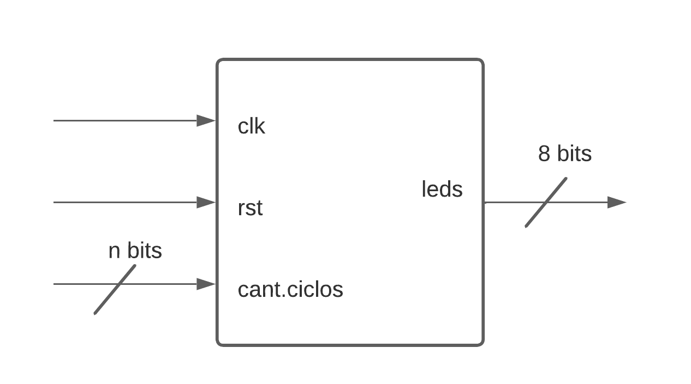

#### 5. Testbench
No hay testbench para este modulo.


### 3.2 Módulo "top_test_clock"

En este modulo se integra el IP-core y el module `test_clock` para poder implementarlo en el testbench con el objetivo de ver su funcionamiento.

#### 1. Encabezado del módulo
```SystemVerilog
 
 module top_test_clock(
    input  logic        clk_pi, 
    input  logic        rst_pi,
    output logic [7:0]  leds1_po,
    output logic [7:0]  leds2_po
    );

```
#### 2. Parámetros
No hay parametros para este modulo.

#### 3. Entradas y salidas:

- `clk_pi`: reloj del modulo.
- `rst_pi`: reset del modulo.
- `leds1_po`: cuenta del clock del IP.
- `leds2_po`: cuenta del clock de la FPGA.


#### 4. Criterios de diseño

El siguiente diagrama de bloques representa el modulo `top_test_clock`

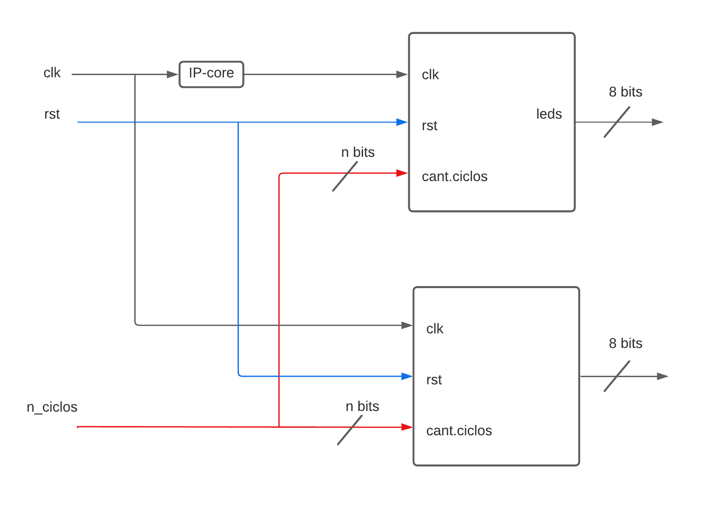

#### 5. Testbench

En la simulacion presentada a continuacion se aprecia como el contador de 100Mhz siempre es 10 veces mayor al contador de 10MHz, esa fue la condicion de autovalidacion.
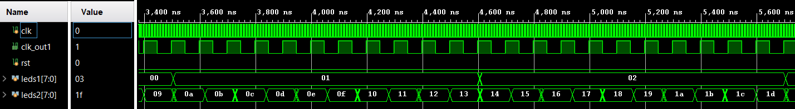


### 3.3 Módulo "anti_rebote"

El presente modulo se encarga de eliminar los rebotes del boton por medio de una maquina de estados.

#### 1. Encabezado del módulo
```SystemVerilog
 
module anti_rebote(
        input logic clk_i, 
        input logic rst_i, 
        input logic bn_i,
        
        output logic p_o

    );

```
#### 2. Parámetros
No hay parametros para este modulo.

#### 3. Entradas y salidas:

- `clk_i`: reloj del modulo.
- `rst_i`: reset del modulo.
- `bn_i`: entrada del boton.
- `p_o`: pulso limpio.


#### 4. Criterios de diseño

A continuacion se presenta el bloque que representa el modulo y la maquina de estados que lo hace funcionar.

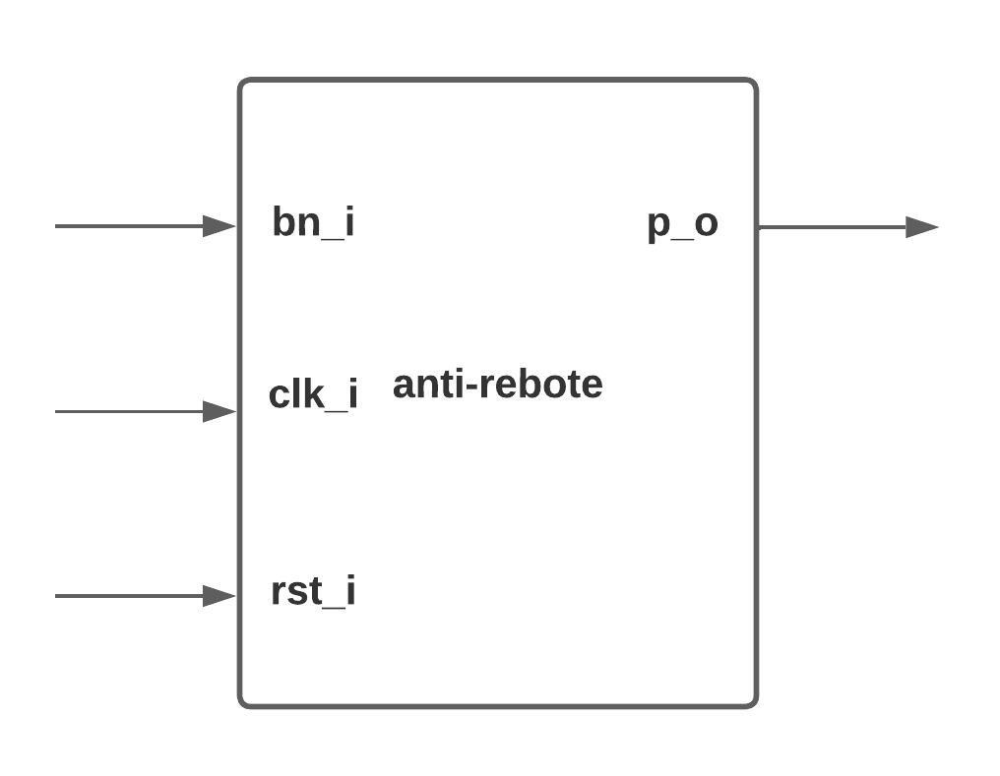

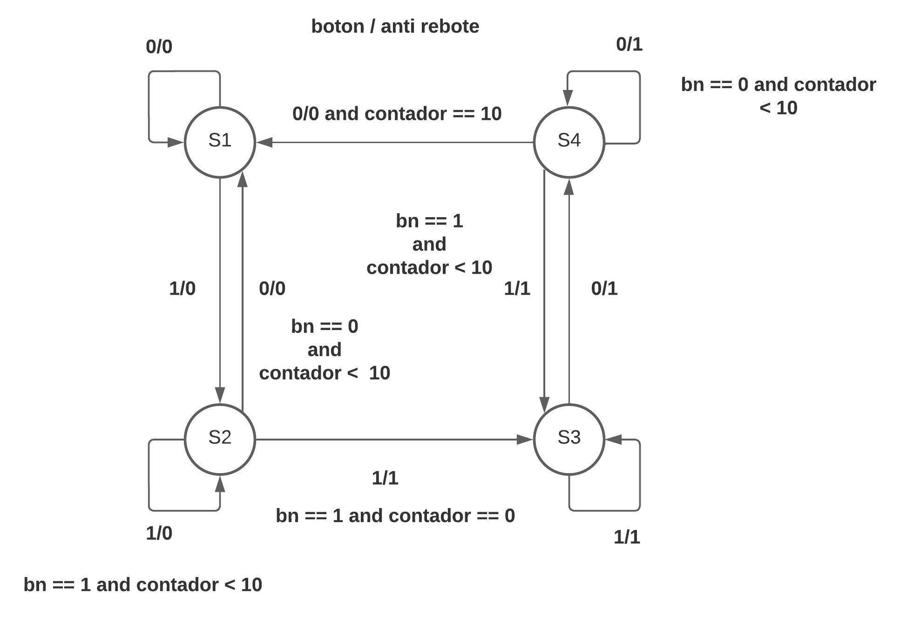


#### 5. Testbench

No hay simulacion para este modulo.


### 3.4 Módulo "sincronizador"

El presente modulo se encarga de sincronizar la entrada de boton con respecto al reloj interno.

#### 1. Encabezado del módulo
```SystemVerilog
 
module sincronizador (

    input  logic clck_i,
    input  logic d_i,
    output logic q_o

    );

```
#### 2. Parámetros
No hay parametros para este modulo.

#### 3. Entradas y salidas:

- `clk_i`: reloj del modulo.
- `d_i`: entrada desincronizada.
- `q_o`: salida sincronizada.


#### 4. Criterios de diseño

Para el diseño se uso un `always_ff` donde internamente tiene 3 flip-flops interconectados para que estos en el `posedge` del `clk_i` reciban el pulso y en la salida lo sincronicen con el reloj, el diagrama se presenta a continuacion:

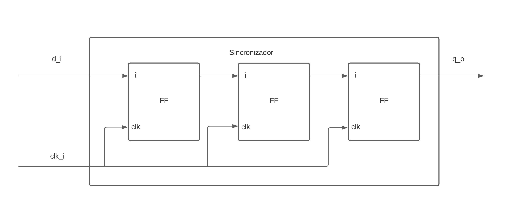


#### 5. Testbench

No hay simulacion para este modulo.


### 3.5 Módulo "top_anti_rebote"

El presente modulo une el `anti_rebote` y el `sincronizador` para obtener un modulo mas completo.

#### 1. Encabezado del módulo
```SystemVerilog
 
module top_antirebotes (
    
    input  logic clck_i,
    input  logic btn_i,
    input  logic rst_i,

    output logic btn_signal_o
);


```
#### 2. Parámetros
No hay parametros para este modulo.

#### 3. Entradas y salidas:

- `clk_i`: reloj del modulo.
- `btn_i`: entrada desincronizada.
- `rst_i`: reset del modulo.
- `btn_signal_o`: salida limpia y sincronizada del modulo.

#### 4. Criterios de diseño

Se interconectaron los modulos `anti_rebote` y`sincronizador`.

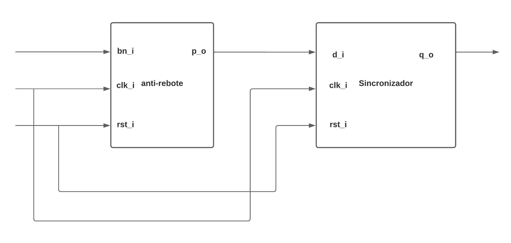


#### 5. Testbench

No hay simulacion para este modulo.


### 3.6 Módulo "test_anti_rebote"

En el presente modulo se une el modulo `top_antire_rebote` y el modulo `contador` para poder apreciar el momento en el que la suma se desfasa debido a los rebotes del boton fisico.


#### 1. Encabezado del módulo
```SystemVerilog
 
module test_anti_rebote(
    input logic         bn_i, 
    input logic         clk_i,
    
    output logic [15:0] led_o,
    output logic [6:0]  seg_o,
    output logic [3:0]  en_o
    
    );


```

#### 2. Parámetros
No hay parametros para este modulo.

#### 3. Entradas y salidas:

- `bn_i`: boton de entrada para el modulo.
- `clk_i`:reloj del modulo.
- `led_o`: sumas representadas en los leds.
- `seg_o`: sumas representadas en el display.
- `en_o`: enables para los anodos.

#### 4. Criterios de diseño

Se interconectaron los modulos `top_anti_rebote` y `contador`, se establece un contador para la señal del boton rebote y otra sin rebote, de esta forma se apreciara el cambio.

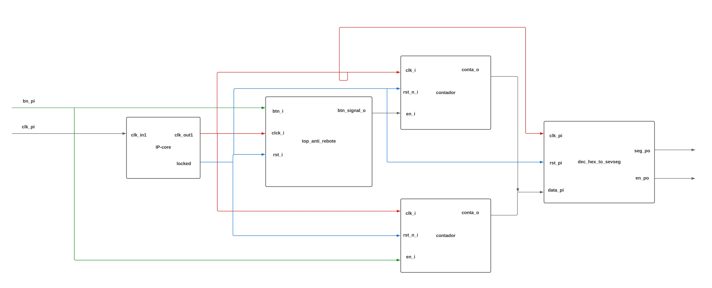


#### 5. Testbench
En la simulacion se compara el boton con rebote y sin sincronizar con el limpio y sincronizado.

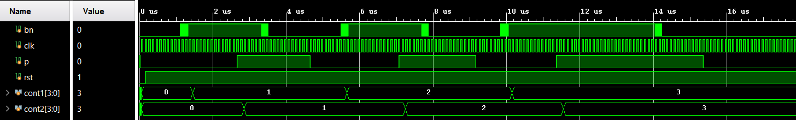


### 3.7 Módulo "clock divider"

Modulo que dividará el clock proveniente de un clock wizard para habilitad otros elementos

#### 1. Encabezado del módulo
```SystemVerilog
module clock_divider (

    input logic clck_i,
    input logic rst_i,

    output logic clck_divided_o

    );
```
#### 2. Parámetros
- El modulo no presenta parámetros

#### 3. Entradas y salidas:
- `clck_i`: Reloj de 10 MHz
- `rst_i`: Reinicio del contador
- `clck_divided_o`: Una señal de 200 Hz, donde da un pulso cada 50000 ticks de reloj.

#### 4. Criterios de diseño

El diseño realizado en el este modulo corresponde al mostrado en la siguiente figura. Donde es un contador que se reinicia al llegar a un cierto número. 


#### 5. Testbench
Para el testbench simplemente se observó el comportamiento en una simulación post sintesis y post implementación. En las siguientes imagenes se puede ver como se genera un pulso cada 5 ms dando una señal con frecuencia de 200 Hz. 


### 3.8 Módulo "contador_2_bits"

Corresponde a un contador de 2 bits que barrerá el teclado, este posee un stop y un enable que es cuando lo permite contar. 

#### 1. Encabezado del módulo
```SystemVerilog
module contador_2_bits (
    
    input  logic       clck_i,
    input  logic       enable_i,
    input  logic       hold_i,
    input  logic       rst_i,
    output logic [1:0] state_o
    
    );
```
#### 2. Parámetros
- El modulo no presenta parámetros

#### 3. Entradas y salidas:
- `clck_i`: Entrada de reloj de 10 MHz.
- `enable_i`: Entrada del habilitador del contador, permitirá contar solo cuando haya un 1. Aquí se usará el clock_divider. 
- `hold_i`: Entrada que corresponde a un stop que dentrá el contador cuando entre un valor de 1.
- `rst_i`: Entrada de un valor de reset. 
- `state_o`: Una señal de 200 Hz, donde da un pulso cada 50000 ticks de reloj.

#### 4. Criterios de diseño

El diseño realizado en el este modulo corresponde al mostrado en la siguiente figura. Donde corresponde a un contador de 2 bits que solo contadorá cuando haya un 1 en el enable y sienta un pulso de reloj, y se detendrá si siente un 1 en hold. La salidas barrerá el teclado hexadecimal. 


#### 5. Testbench
Para el testbench simplemente se observó el comportamiento en una simulación post sintesis y post implementación. En las siguientes imagenes se puede ver como el contador solo cuenta cuando hay un 1 en enable_i y un pulso de reloj, y se detiene cuando hay un 1 en hold_i.


### 3.9 Módulo "d_flip_flop"

corresponde a un d flip flop que guardará cada vez que sienta un flanco positivo en un habilitador. 

#### 1. Encabezado del módulo
```SystemVerilog

    
 module d_flip_flop (

    input logic enable_i,
    input logic d_i,
    output logic q_o
    
    );

```
#### 2. Parámetros
- El modulo no presenta parámetros

#### 3. Entradas y salidas:

- `enable_i`: Entrada del habilitador de guardado. 
- `d_i`: Entrada que corresponde al dato que se desea guardar.
- `q_o`: Salida valor guardado.

#### 4. Criterios de diseño

El diseño de este bloque no posee mucha dificultad. Simplemente cada vez que se sienta un flanco positivo de enable_i la salida q_o será igual a d_i

#### 5. Testbench
Para el testbench simplemente se observó el comportamiento en una simulación post sintesis y post implementación. En las siguientes imagenes se puede ver como q_o solo guarda el valor de d_i cuando hay un flanco positivo del enable_i y mantiene este valor.


### 3.10 Módulo "key_deteccion"

Corresponde a un detector de tecla dentrá el contador de 2 bits y dirá cuando los flip flop deben guardar valores. En este se utilizará el modulo antirebotes realizado con anterioridad.

#### 1. Encabezado del módulo
```SystemVerilog

    
 module key_deteccion (
    
    input  logic  [3 : 0] filas_i,
    input  logic          clck_i,
    input  logic          locked,
    output logic         deteccion_o
    
);

```
#### 2. Parámetros
- El modulo no presenta parámetros

#### 3. Entradas y salidas:

- `filas_i`: Entrada de las filas de los botones. 
- `clck_i`: Entrada del clock para los antirebotes.
- `locked_i`: Entrada de un reseteo para los antirebotes.
- `deteccion_o`: Salida de la detección.

#### 4. Criterios de diseño

Primeramente se planteó una lógica con un codificador con la tabla de verdad como se muetra en la imagen. 


Sin embargo, dado el comportamiento del antirebotes realizado con anterioidad se procedio a realizar una nueva lógica. Esta corresponde a conectar un not en las entradas de las filas debido a que el antirebotes reconoce como tecla no tocada a un 0 mientras que en el teclado es un 1, posteriormente se instanció el modulo 4 veces y la salida de estos cuatro se unió con un xor reductivo que descarte el hecho de presionar 2 al mismo tiempo. Basado en esta lógica el key_deteccion generará un 1 cuando se presione una tecla.

#### 5. Testbench

Para el testbench simplemente se observó el comportamiento en una simulación post sintesis y post implementación. En las siguientes imagenes se puede ver como solo cuando se preciona una fila el key detección se activa.


### 3.11 Módulo "key_encoding"

Corresponde a un codificador de tecla que determina el número que se está tocando dependiendo de las columnas y las filas. 

#### 1. Encabezado del módulo
```SystemVerilog

    
module key_encoding (

    input logic  columna1_i,
    input logic  columna0_i,
    
    input logic  fila1_i,
    input logic  fila0_i,
    
    output logic [ 3 : 0] num_o

    );

```
#### 2. Parámetros
- El modulo no presenta parámetros

#### 3. Entradas y salidas:

- `columna1_i`: Entrada del primer bit que determina en cual columna se encuentra la tecla presionada.
- `columna0_i`: Entrada del segundo bit que determina en cual columna se encuentra la tecla presionada.
- `fila1_i`: Entrada del primer bit que determina que fila en el teclado se presionó.
- `fila0_i`: Entrada del segundo bit que determina que fila en el teclado se presionó.
- `num_o`: Salida del número correspondiente para el teclado usado.

#### 4. Criterios de diseño

Primeramente se planteó una lógica con un codificador con la tabla de verdad como se muetra en la imagen. 


Sin embargo, en la práctica se utilizo una lógica negativa en la filas del teclado, por lo que la tabla de verdad cambió  a la siguiente. 


#### 5. Testbench

Para el testbench simplemente se observó el comportamiento en una simulación post sintesis y post implementación. En las siguientes imagenes se puede el cumplimiento del número correspondiente según la fila y columna presionada. 


### 3.12 Módulo "top_interfaz"

Corresponde al top del interfaz de teclado. 

#### 1. Encabezado del módulo
```SystemVerilog

    
module top_interfaz (
    
    input logic clck_i,
    input logic  [3 : 0] filas_i,
    input logic  [1 : 0] filas_codificadas_i,  
    output logic [1 : 0] salidas_contador_o,
    output logic [3 : 0] numero_o,
    output logic led_o
    
    
);

```
#### 2. Parámetros
- El modulo no presenta parámetros

#### 3. Entradas y salidas:

- `clck_i`: Entrada del reloj de 10 MHz.

- `filas_i`: Entrada de las filas que indican si se presionó alguna.
- `filas_codificadas_i`: Entrada de las filas codificadas que indican cual fila se presionó.
- `salidas_contador_o`: Salida del contador que barre el teclado.
- `numero_o`: Salida del número correspondiente para el teclado usado.
- `led_o`: Salida de un indicador que se presionó una tecla

#### 4. Criterios de diseño

La lógica de este top corresponde a conectar los modulos como se muestra en la siguiente imagen. 


#### 5. Testbench

Para el testbench simplemente se observó el comportamiento en una simulación post sintesis y post implementación con una autoverificación. En la siguiente imagen se puede ver los resultados. 


### 3.13 Módulo "interfaz_para_prueba"

Corresponde al top del interfaz de teclado unido a un 7 segmentos para demostrar los valores. 

#### 1. Encabezado del módulo
```SystemVerilog

    
module interfaz_para_prueba (

    input logic clk_i,
    input logic  [3 : 0] filas_i,
    input logic  [1 : 0] filas_codificadas_i,  
    output logic [1 : 0] salidas_contador_o,
    output logic [7 : 0] numero_o,
    output logic [3 : 0] enable_o,
    output logic led_o
);

```
#### 2. Parámetros

- El modulo no presenta parámetros

#### 3. Entradas y salidas:

- `clck_i`: Entrada del reloj de 10 MHz.
- `filas_i`: Entrada de las filas que indican si se presionó alguna.
- `filas_codificadas_i`: Entrada de las filas codificadas que indican cual fila se presionó.
- `salidas_contador_o`: Salida del contador que barre el teclado.
- `numero_o`: Salida del número correspondiente para el teclado usado.
- `led_o`: Salida de un indicador que se presionó una tecla

#### 4. Criterios de diseño

Para este modulo simplemente se unió el interfaz con el clock wizard y un 7 segmentos realizado en lab anterior. 
#### 5. Testbench
No se realizó testbench debido a que era para probarlo en FGPA

#### 6. Tabla de constraints

Se realizó la siguiente asignación de pines y elementos de la FPGA.


| Señal         | Pin   | En tarjeta   |
| ------------- |:-----:| ------------:|
| clk_i         | W5    | CLK          |
| led_o         | U16   | LED0         |
| numero_o[5]   | W7    | Seven_display|
| numero_o[6]   | W6    | Seven_display|
| numero_o[0]   | U8    | Seven_display|
| numero_o[1]   | V8    | Seven_display|
| numero_o[2]   | U5    | Seven_display|
| numero_o[4]   | V5    | Seven_display|
| numero_o[3]   | U7    | Seven_display|
| enable_o[0]   | U2    | Seven_display anodo|
| enable_o_o[1] | U4    | Seven_display anodo|
| enable_o[2]   | V4    | Seven_display anodo|
| enable_o[3]   | W4    | Seven_display anodo|
| filas_i[0]    | J1    | JA1|
| filas_i[1]    | L2    | JA2|
| filas_i[2]    | J2    | JA3|
| filas_i[3]    | G2    | JA4|
| salidas_contador_o[0]    | H1    | JA7|
| salidas_contador_o[1]    | K2    | JA8|
| filas_codificadas_i[0]    | J1    | JA9|
| filas_codificadas_i[1]    | L2    | JA10|

### 3.14 Módulo "en_anode"

El modulo se encarga de activar el anodo correspondiente al valor que se esta mostrando en el display.

#### 1. Encabezado del módulo
```SystemVerilog

module en_anode(
    input  logic [1:0] sel_i,
    output logic [3:0] en_o
    );
   
```
#### 2. Parámetros
No hay parametros para este modulo.

#### 3. Entradas y salidas:

- `sel_i`: seleccion del anodo a habilitar.
- `en_o`: salida habilitadora.


#### 4. Criterios de diseño

A continuacion se representa el bloque correspondiente al modulo, el diseño interno se basa en un case

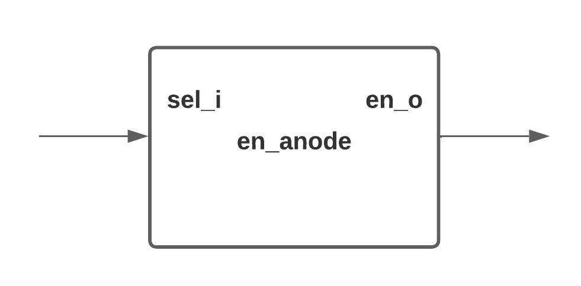

#### 5. Testbench
No hay testbench para este modulo.


### 3.14 Módulo "dec_hex_to_sevseg"

Modulo encargado del funcionamiento completo del 7 segmentos, haciendo uso de modulos creados previamente (`top_segsev`,`contador_2_bits`,`clock_divider`).

#### 1. Encabezado del módulo
```SystemVerilog

module dec_hex_to_sevseg(
    input  logic        clk_pi,
    input  logic        rst_pi,
    input  logic [15:0] data_pi,
    output logic [3:0]  en_po,
    output logic [6:0]  seg_po
   );
   
```
#### 2. Parámetros
No hay parametros para este modulo.

#### 3. Entradas y salidas:

- `clk_pi`: seleccion del anodo a habilitar.
- `rst_pi`: salida habilitadora.
- `data_pi`: entrada del dato a transformar
- `en_po`: salida habilitadora de los anodos.
- `seg_po`: salida de los siete segmentos. 


#### 4. Criterios de diseño

Como fue mencionado anteriormente en este modulo se conectaron otros modulos creados en ejercicios y laboratorios anteriores, a continuacion se muestra el ddiagrama de bloques.


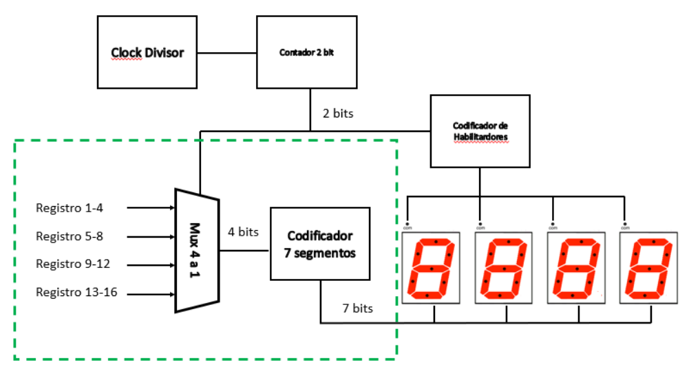

#### 5. Testbench
No hay testbench para este modulo.


### 3.15 Módulo "register_n_bits"

Modulo encargado de guardar un valor que sera presentado en el display de siete segmentos.

#### 1. Encabezado del módulo
```SystemVerilog

module register_n_bits
    #(
        parameter N = 16
    )
    (
    input  logic               clk_i, rst_i, we_i,
    input  logic  [ N - 1 : 0] data_i,
    output logic  [ N - 1 : 0] data_o
    );
   
```
#### 2. Parámetros
-`N`: indica el tamaño de los datos.

#### 3. Entradas y salidas:

- `clk_i`: reloj del modulo.
- `rst_i`: reset del moddulo.
- `data_i`: dato de entrada.
- `we_i`: habilitador de escritura.
- `data_o`: dato de salida guardado en el registro.


#### 4. Criterios de diseño

Se uso un `always_ff` con `posedge` del `clk_i` donde si `we_i` estaba en alto entonces escribe `data_i` en `data_o`, continuacion se muestra el bloque representativo.

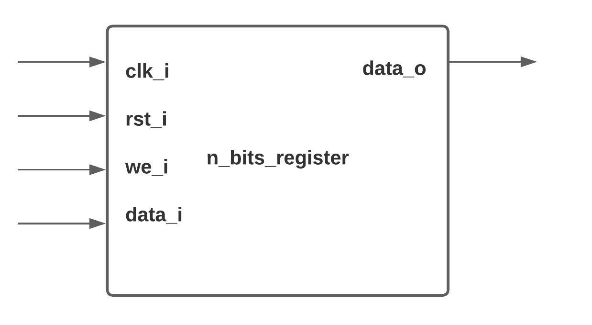


#### 5. Testbench
No hay testbench para este modulo.


### 3.16 Módulo "en_per_seg"

Modulo encargado de habilitar un enable cada dos segundos.

#### 1. Encabezado del módulo
```SystemVerilog

module en_per_seg
(
 
    input logic       clk_i,
    input logic       rst_i,
    input logic [3:0] seg_i,
    
    output logic      en_o
    );
   
```
#### 2. Parámetros
Este modulo no posee parametros.

#### 3. Entradas y salidas:

- `clk_i`: reloj del modulo.
- `rst_i`: reset del moddulo.
- `seg_i`: salida para los siete segmentos.
- `en_o`: salida habilitadora de anodos.


#### 4. Criterios de diseño
Se diseño uso un `always_ff` con una variable contadora que cada 20M ciclos tira un pulso. A continuacion, se muestra el bloqe representativo.

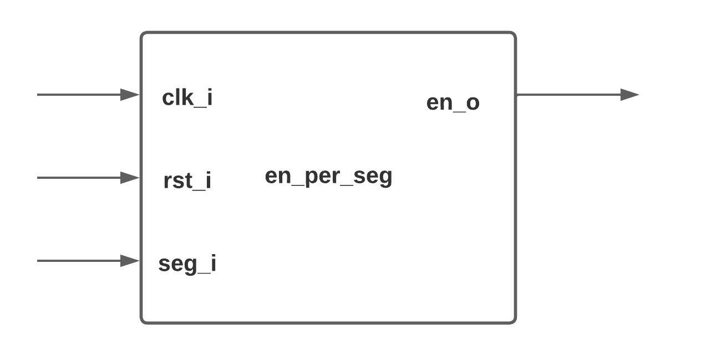


#### 5. Testbench
No hay testbench para este modulo.


### 3.17 Módulo "module_sevseg"

Modulo que se encarga de pasar de 7 segmentos a numero de hexadecimal con el fin de hacer autoverificacion en el testbench.

#### 1. Encabezado del módulo
```SystemVerilog

module module_sevseg(
    input  logic  [3:0] d_i,
    output logic  [6:0] s_o
    
    );
   
```
#### 2. Parámetros
Este modulo no posee parametros.

#### 3. Entradas y salidas:

- `d_i`: reloj del modulo.
- `s_i`: reset del moddulo.


#### 4. Criterios de diseño
Se uso un case con cada caso de los 7 segmentos, a ontinuacion bloque representativo.

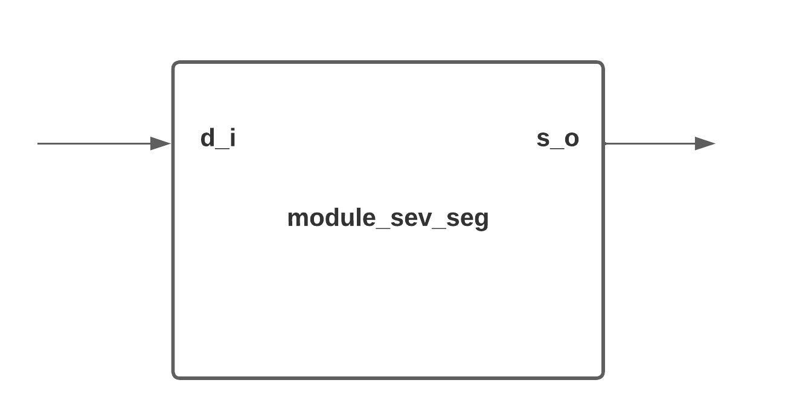


#### 5. Testbench
No hay testbench para este modulo.


### 3.18 Módulo "test_hex_to_segsev"

El presente modulo usa el generador de datos aleatorios (`LFSR`), el `en_per_seg`, `n_bits_register` y el `dec_hex_to_sevseg` con el fin de guardar un dato cada 2 segundos y poder verlo en el 7 segmentos.

#### 1. Encabezado del módulo
```SystemVerilog

module test_hex_to_segsev(
    input  logic        clk_pi,
    
    output logic [3:0]  en_po,
    output logic [6:0]  seg_po,
    output logic [15:0] led
   );
   
```
#### 2. Parámetros
Este modulo no posee parametros.

#### 3. Entradas y salidas:

- `clk_pi`: reloj del modulo.
- `en_po`: habilitador de anodo.
- `seg_po`: salida de 7 segmentos .
- `led`: salida de los datos en los leds.


#### 4. Criterios de diseño
Se interconectaron los modulos mencionados anteriormente, la conexion se aprecia en el siguiente diagrama de bloques.

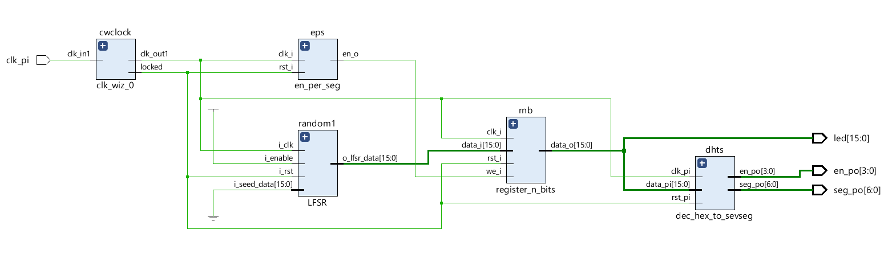


#### 5. Testbench
No hay testbench para este modulo.

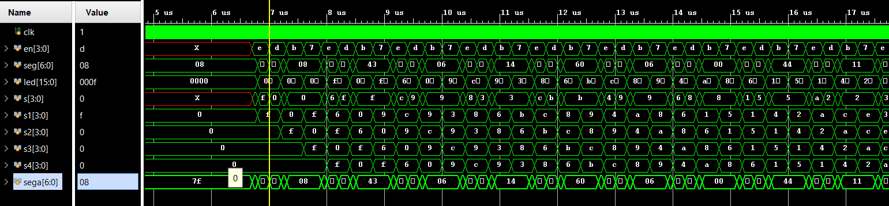

### 3.19 Módulo "module_pc"

Este módulo corresponde a un program counter con cuatro funciones básicas de reset, hold, incremento + 4 y salto. 

#### 1. Encabezado del módulo
```SystemVerilog

module module_pc #(
    parameter W = 4        
)(
    input  logic [W-1:0]  pc_i,
    input  logic [1:0]    pc_op_i,
    input  logic          clk_i,
    input  logic          reset_i,
    output logic [W-1:0]  pc_o,
    output logic [W-1:0]  pcinc_o
);
   
```
#### 2. Parámetros
- `W`: Define el ancho de la entrada y salida de los datos del program counter.

#### 3. Entradas y salidas:

- `clk_i`: Entrada del reloj de 10 MHz.
- `reset_i`: Entrada del reset.
- `pc_i`: Entrada de datos para la operación de salto.
- `pc_op_i`: Entrada de selección de operación.
- `pc_o`: Salida del contador
- `pcinc_o`: Salida adicional que muestra la salida del contador antes del salto incrementada en cuatro.

#### 4. Criterios de diseño

Los criterios de diseño para el program counter se basan en el siguiente diagrama de bloques.


La entrada `pc_op_i` tiene la siguiente codificación:
- `2b'00`: Resetea la salida (Reset).
- `2b'01`: Mantiene la salida (Hold).
- `2b'10`: Incrementa la salida del contador en cuatro (`pc_o`+4).
- `2b'01`: Cambia la salida a un valor específico dado por la entrada `pc_i`.

#### 5. Testbench

El testbench del program counter se encuentre en tb_module_pc.sv. En este testbench se genera una instancia del modulo "module_pc" con un valor de `W` de 4 bits y se prueban cada una de las opciones para la entrada `pc_op_i`. Ademas con el comando `assert` se verifica que las salidas sean las esperadas.
La prueba que se muestra a continuación es simulación post-síntesis.


### 3.20 Módulo "top_pc"

Este modulo corresponde al top del program counter diseñado para implementarse en la FPGA Basys 3.

#### 1. Encabezado del módulo
```SystemVerilog

module top_pc (
    input  logic       clk_pi,
    input  logic [1:0] pcop_pi,
    input  logic [3:0] salto_pi,
    
    output logic [6:0] seg_po,
    output logic [3:0] en_po
);
   
```
#### 2. Parámetros

Este módulo no posee parámetros.

#### 3. Entradas y salidas:

- `clk_pi`: Entrada del reloj de 10 MHz.
- `pcop_pi`: Entrada de selección de operación.
- `salto_pi`: Entrada de datos para la operación de salto.
- `seg_po`: Salida del display de siete segmentos.
- `en_po`: Salida del "enable" para el siete segmentos.

#### 4. Criterios de diseño

Este módulo se instancia el clocking wizard, el módulo `module_pc`, el módulo `en_per_seg` y el módulo `dec_hex_to_sevseg` previamente explicados.

#### 5. Testbench

No se realizó un testbench para este módulo, ya que será implementado en una FPGA.

### 3.21 Módulo "module_banco_de_registros"

Este módulo corresponde a un baco de registros con una entrada para escritura y dos salidas para lectura 

#### 1. Encabezado del módulo
```SystemVerilog

module module_banco_de_registros 
#(
    parameter N = 32,
    parameter W = 8
)(
    input  logic [$clog2 (N)-1:0]  addr_rs1,
    input  logic [$clog2 (N)-1:0]  addr_rs2,
    input  logic [$clog2 (N)-1:0]  addr_rd,
    input  logic                   clk,
    input  logic                   we,
    input  logic                   rst,
    input  logic [W-1:0]           data_in,
    output logic [W-1:0]           rs1,
    output logic [W-1:0]           rs2
);
   
```
#### 2. Parámetros
- `N`: Corresponde a la cantidad de registros que se almacenarán en el banco de registros.
- `W`: Corresponde al ancho de los datos que serán almacenados en el banco de registros.

#### 3. Entradas y salidas:

- `addr_rs1`: Entrada de la posición dentro del banco que se desea leer en rs1.
- `addr_rs2`: Entrada de la posición dentro del banco que se desea leer en rs2.
- `addr_rd`: Entrada de la dirección en donde se desea almacenar el dato de entrada.
- `clk`: Entrada del reloj de 10 MHz.
- `we`: Entrada que activa la escritura en el banco de registros.
- `rst`: Entrada del reset.
- `data_in`: Entrada del dato que se desea almacenar en el banco de registros.
- `rs1`: Salida de lectura 1
- `rs2`: Salida de lectura 2.

#### 4. Criterios de diseño

El criterio de diseño de este banco de registros se basa en el siguiente diagrama.


Donde la lógica de escritura se basa en la siguiente figura.


Y la lógica de lectura se basa en la siguiente figura.


#### 5. Testbench

Para el testbench de este módulo se ingresaron datos aleatorios los cuales se guardaron en direcciones aleatorias y además se fueron mostrando aleatoriamente los datos guardados en las salidas de lectura del banco de registros, además se agregó la función de autochequeo al añadir dos direcciones extra de comparacion como se puede ver en la siguiente imágen.


### 3.22 Módulo "top_banco_de_registros"

Este modulo corresponde al top del banco de registros diseñado para implementarse en la FPGA Basys 3.

#### 1. Encabezado del módulo
```SystemVerilog

module top_banco_de_registros (
    input  logic [3:0] data_in,
    input  logic [4:0] addr_rd,
    input  logic [4:0] addr_rs1,
    input  logic [4:0] addr_rs2,
    input  logic       we,
    input  logic       clk,
    
    output logic [3:0] rs1,
    output logic [3:0] rs2
);
   
```
#### 2. Parámetros

Este módulo no posee parámetros.

#### 3. Entradas y salidas:

- `addr_rs1`: Entrada de la posición dentro del banco que se desea leer en rs1.
- `addr_rs2`: Entrada de la posición dentro del banco que se desea leer en rs2.
- `addr_rd`: Entrada de la dirección en donde se desea almacenar el dato de entrada.
- `clk`: Entrada del reloj de 10 MHz.
- `we`: Entrada que activa la escritura en el banco de registros.
- `data_in`: Entrada del dato que se desea almacenar en el banco de registros.
- `rs1`: Salida de lectura 1
- `rs2`: Salida de lectura 2.

#### 4. Criterios de diseño

Este módulo se instancia el clocking wizard y el módulo `module_banco_de_registros`, previamente explicados.

#### 5. Testbench

No se realizó un testbench para este módulo, ya que fue implementado en la FPGA.

### 3.23 Módulo "module_datapath"

Para este módulo se unieron algunos de los módulos descritos anteriormente como lo es el teclado, el mux, el banco de registros, la ALU, y el 7 segmentos, donde esto corresponde a una ruta de datos.

#### 1. Encabezado del módulo
```SystemVerilog

module module_datapath(

    input logic [3:0] teclado_i,
    input logic       clk,
    input logic       reset,
    input logic       mux_sel,
    input logic [4:0] addr_rs1,
    input logic [4:0] addr_rs2,
    input logic [4:0] addr_rd,
    input logic       we_banco,
    input logic       WE,
    input logic [3:0] op_alu,
    output logic [6:0] seg_o,
    output logic [3:0] en_o
    );
   
```
#### 2. Parámetros
- Este módulo no tiene parámetros.

#### 3. Entradas y salidas:

- `teclado_i`: Entrada del teclado.
- `mux_sel`: Selecciona cual salida debe tener el mux si el teclado o el resultado de la operación de la ALU.
- `addr_rs1`: Entrada de la posición dentro del banco que se desea leer en rs1.
- `addr_rs2`: Entrada de la posición dentro del banco que se desea leer en rs2.
- `addr_rd`: Entrada de la dirección en donde se desea almacenar el dato de entrada.
- `clk`: Entrada del reloj de 10 MHz.
- `we_banco`: Entrada que activa la escritura en el banco de registros.
- `rst`: Entrada del reset.
- `WE`: Entrada que activa el display para mostrar ya sea los operandos o los resultados.
- `op_alu`: Entrada a la ALU que selecciona el tipo de operación.
- `seg_o`: Salida del display.
- `en_o`: Salida del write enable de los ánodos.

#### 4. Criterios de diseño

El criterio de diseño del datapath se basó en la parte dee color negro del siguiente diagrama conceptual de la unidad de cálculo.


#### 5. Testbench

No se realizó testbench para este módulo ya que se probó en el módulo top.

### 3.24 Módulo "module_control"

En este modulo se desarrolló la máquina de estados que controla la mini unidad de cálculo.

#### 1. Encabezado del módulo
```SystemVerilog

module module_control 
(
        input logic        led_tecla_i,
        input logic        switch,
        input logic [3:0]  teclado,
        input logic        clk,
        input logic        rst,

        output logic       led_error,
        output logic       led_operacion,
        output logic       WE,
        output logic [3:0] OP,
        output logic       we_banco,
        output logic [4:0] addr_rs1,
        output logic [4:0] addr_rs2,
        output logic [4:0] addr_rd,
        output logic       mux_sel
 );
    
```
#### 2. Parámetros
El módulo no posee parametros

#### 3. Entradas y salidas

- `led_tecla_i`: Entrada de led indicador de tecla activa.
- `switch`: Entrada de seleccion de modo de operación.
- `teclado`: Entrada de datos por teclado.
- `clk`: Entrada del reloj de 10 MHz.
- `rst`: Entrada del reset.
- `led_error`: Salida de led indicador de que la operacion ingresada es incorrecta.
- `led_operacion`: Salida de led indicador de que la operación ingresada es correcta.
- `WE`: Salida de activación del display de siete segmentos.
- `OP`: Salida de operación para la ALU.
- `we_banco`: Salida de activación para el banco de registros.
- `addr_rs1`: Salida de dirección de escritura del operando 1.
- `addr_rs2`: Salida de dirección de escritura del operando 2.
- `addr_rd`: Salida de escritura del registro.
- `mux_sel`: Salida de selección del multiplexor.

#### 4. Criterios de diseño

El criterio de diseño para el módulo se basa en el siguiente diagrama de bloques, el módulo de control corresponde al indicado en color azul.


#### 5. Testbench

No se realizó testbench para este módulo ya que se probó en el módulo top.

### 3.25 Módulo "module_top_mini_calculo"

Para este módulo se unió el módulo module_control y module_datapath para realizar con ayuda de control operaciones y ver su resultado en el display.

#### 1. Encabezado del módulo
```SystemVerilog

module top_mini_calculo(
    input logic        clk_pi,
    input logic        switch_pi,
    input logic  [3:0] filas_i,
    input logic  [1:0] filas_codificadas_i,
    output logic [1:0] salidas_contador_o,
    output logic       led_error_po,
    output logic       led_op_po,
    output logic [3:0] en_po,
    output logic [6:0] seg_po,
    output logic       led_o
    );
```
#### 2. Parámetros
- Este módulo no tiene parámetros.

#### 3. Entradas y salidas:

- `filas_codificadas_i`: Entrada de teclado codificado.
- `filas_i`: Entrada de teclado.
- `switch_pi`: Entrada de selección de modo de funcionamiento de la mini unidad de cálculo.
- `clk_pi`: Entrada del reloj de 10 MHz.
- `led_error_po`: Salida que indica si se ingresó un operando no válido.
- `led_op_po`: Salida que indica si se ingresó una operación.
- `en_po`: Salida del display.
- `seg_po`: Salida del display .
- `led_o`: Salida que indica si se presionó una tecla.

#### 4. Criterios de diseño

El criterio de diseño para el módulo se basa en el siguiente diagrama de bloques, el módulo de control corresponde al indicado en color azul.


La máquina de estados para el módulo de control se basa en el siguiente diagrama de estados.


#### 5. Testbench

Para el testbench se unieron los módulos del datapath y de control, y se probó ingresando valores de entrada como se observa en la siguiente imágen.


#### 6. Tabla de constraints

Se realizó la siguiente asignación de pines y elementos de la FPGA.


| Señal         | Pin   | En tarjeta   |
| ------------- |:-----:| ------------:|
| clk_i         | W5    | CLK          |
| led_o         | U16   | LED0         |
| numero_o[5]   | W7    | Seven_display|
| numero_o[6]   | W6    | Seven_display|
| numero_o[0]   | U8    | Seven_display|
| numero_o[1]   | V8    | Seven_display|
| numero_o[2]   | U5    | Seven_display|
| numero_o[4]   | V5    | Seven_display|
| numero_o[3]   | U7    | Seven_display|
| enable_o[0]   | U2    | Seven_display anodo|
| enable_o_o[1] | U4    | Seven_display anodo|
| enable_o[2]   | V4    | Seven_display anodo|
| enable_o[3]   | W4    | Seven_display anodo|
| filas_i[0]    | J1    | JA1|
| filas_i[1]    | L2    | JA2|
| filas_i[2]    | J2    | JA3|
| filas_i[3]    | G2    | JA4|
| salidas_contador_o[0]    | H1    | JA7|
| salidas_contador_o[1]    | K2    | JA8|
| filas_codificadas_i[0]    | J1    | JA9|
| filas_codificadas_i[1]    | L2    | JA10|


## Apendices:
### Apendice 1:
texto, imágen, etc
